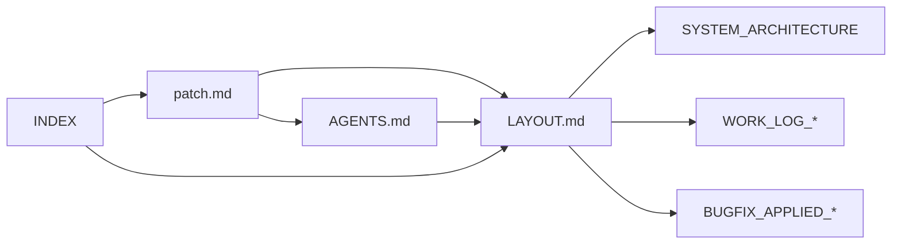

# Docs Index

문서 진입점. SSOT 우선으로 정렬. **각 문서는 최신 작업 내용(WORK_LOG/BUGFIX/plan)을 반영하도록 유지한다.** 요약은 [CHANGELOG](../CHANGELOG.md), 일별/Phase 상세는 WORK_LOG_* 참조.

**최신 작업 소스**: [CHANGELOG](../CHANGELOG.md), [TYPECHECK_AND_LINT_FAILURES](TYPECHECK_AND_LINT_FAILURES.md), [AI_FEATURES](AI_FEATURES.md), [WORK_LOG_20260211](WORK_LOG_20260211.md), [WORK_LOG_20260210_AI_UPGRADE](WORK_LOG_20260210_AI_UPGRADE.md), [NL_COMMAND_INTERFACE_IMPLEMENTATION_REPORT](NL_COMMAND_INTERFACE_IMPLEMENTATION_REPORT.md), [NL_COMMAND_INTERFACE_COMPLETE](NL_COMMAND_INTERFACE_COMPLETE.md), [WORK_LOG_20260209](WORK_LOG_20260209.md), [WORK_LOG_20260202](WORK_LOG_20260202.md), [BUGFIX_APPLIED_20260202](BUGFIX_APPLIED_20260202.md), [IMPLEMENTATION_SUMMARY](IMPLEMENTATION_SUMMARY.md), [plan/](plan/)

### 문서 REF 관계 (Mermaid)

## 1. SSOT / 계약 (루트)

| 문서 | 설명 |
|------|------|
| [patch.md](../patch.md) | UI/UX 패치 스펙 (SSOT) |
| [patch4.md (archived)](../archive/docs_20260203/patch4.md) | 패치 v4 상세 |
| [AGENTS.md](../AGENTS.md) | 에이전트 규칙·워크플로우 |

## 2. 설계 / 레이아웃 (docs)

| 문서 | 설명 |
|------|------|
| [LAYOUT.md](LAYOUT.md) | 레이아웃·3열·반응형 계약 |
| [SYSTEM_ARCHITECTURE.md](SYSTEM_ARCHITECTURE.md) | 시스템 아키텍처 |

## 3. 계획·검증 (docs/plan)

| 문서 | 설명 |
|------|------|
| [document-integration-plan.md](plan/document-integration-plan.md) | 문서 통합·Ref 일관성 (Phase A~C, tr-planner 참조) |
| [plan_patchmain_14.md](plan/plan_patchmain_14.md) | patchmain 14-item (Tidy First, 2026-02-04) |
| [tr-dashboard-plan.md](plan/tr-dashboard-plan.md) | 대시보드 계획 |
| [tr-dashboard-plan-patch4.md](plan/tr-dashboard-plan-patch4.md) | 패치4 계획 |
| [tr-dashboard-verification-report.md](plan/tr-dashboard-verification-report.md) | 검증 리포트 |
| [gantt-reset-button-fix-plan.md](plan/gantt-reset-button-fix-plan.md) | Gantt 리셋 버튼 수정 (2026-02-09) |
| [vis-timeline-gantt-integration-plan.md](plan/vis-timeline-gantt-integration-plan.md) | Gantt 연동 계획 |
| [vis-timeline-phase1-implementation.md](plan/vis-timeline-phase1-implementation.md) | VisTimeline Phase 1 구현 (A3 Mapper Caching, B5 Dependency Type) |
| [weather-overlay-implementation-plan.md](plan/weather-overlay-implementation-plan.md) | Weather Overlay 상세 구현 계획 (Canvas 배경 레이어) |

## 4. 가이드 (docs/guides)

| 문서 | 설명 |
|------|------|
| [patch-guide.md](guides/patch-guide.md) | 패치 적용 가이드 |
| [tr-subagents.md](guides/tr-subagents.md) | TR 서브에이전트 |
| [agi-schedule-updater.md](guides/agi-schedule-updater.md) | AGI 스케줄 업데이터 |
| [termux-ssh-cursor.md](guides/termux-ssh-cursor.md) | Termux/SSH/Cursor |

## 5. 작업·버그픽스 (docs)

| 문서 | 설명 |
|------|------|
| [CHANGELOG.md](../CHANGELOG.md) | 릴리즈·배포 요약 (Added/Fixed 등) |
| [TYPECHECK_AND_LINT_FAILURES.md](TYPECHECK_AND_LINT_FAILURES.md) | Typecheck/Lint 실패 원인 정리 및 해결 내역 (2026-02-11, 0 errors 달성) |
| [WORK_LOG_20260210_AI_UPGRADE.md](WORK_LOG_20260210_AI_UPGRADE.md) | AI 업그레이드 작업 로그 (Ollama/EXAONE, ambiguity 재질의 포함) |
| [AI_FEATURES.md](AI_FEATURES.md) | AI 기능 전용 상세 문서 (아키텍처/정책/테스트/운영) |
| [NL_COMMAND_INTERFACE_IMPLEMENTATION_REPORT.md](NL_COMMAND_INTERFACE_IMPLEMENTATION_REPORT.md) | NL Command 구현 리포트 (현재 구현 기준) |
| [NL_COMMAND_INTERFACE_COMPLETE.md](NL_COMMAND_INTERFACE_COMPLETE.md) | NL Command 현재 상태 요약 |
| [WORK_LOG_20260206_COMPLETE.md](WORK_LOG_20260206_COMPLETE.md) | 4대 기능 + SSOT Trip/TR 정합성 수정 완료 로그 |
| [WORK_LOG_20260206.md](WORK_LOG_20260206.md) | 2026-02-06 작업 로그 |
| [WORK_LOG_20260209.md](WORK_LOG_20260209.md) | 작업 로그 (2026-02-09, Gantt 리셋 수정) |
| [WORK_LOG_20260202.md](WORK_LOG_20260202.md) | 2026-02-02 작업 로그 |
| [BUGFIX_APPLIED_20260202.md](BUGFIX_APPLIED_20260202.md) | 버그픽스 적용 |
| [IMPLEMENTATION_SUMMARY.md](IMPLEMENTATION_SUMMARY.md) | 구현 요약 |

## 6. 운영·배포 (docs/ops)

| 문서 | 설명 |
|------|------|
| [release-split.md](ops/release-split.md) | 일반/모바일 배포 분리 운영 절차 |
| [release-history-20260211.md](ops/release-history-20260211.md) | Release Split 실행 기록 (2026-02-11, T1~T4) |

## 7. 기타

| 문서 | 설명 |
|------|------|
| [CURSOR_UPDATE_GUIDE.md](CURSOR_UPDATE_GUIDE.md) | Cursor 업데이트 |
| [AGENT_DASHBOARD_INTEGRATION.md](AGENT_DASHBOARD_INTEGRATION.md) | 에이전트·대시보드 연동 |
| [FILES_PHASE4_PHASE5_OVERVIEW.md](FILES_PHASE4_PHASE5_OVERVIEW.md) | files/ Phase 4·5 문서 요약·관계 |
| [VERCEL.md](VERCEL.md) | 배포(Vercel) |
| [00_INBOX/chat/](00_INBOX/chat/README.md) | 대화 요약·메모 |

## 8. DocOps 메타

| 경로 | 설명 |
|------|------|
| [_meta/inventory/](_meta/inventory/) | 문서 인벤토리 |
| [_meta/plans/](_meta/plans/) | 이동·변경 계획 |
| [_meta/reports/](_meta/reports/) | 검증 리포트 |

---

## Refs

- [patch.md](../patch.md)
- [AGENTS.md](../AGENTS.md)
- [CHANGELOG.md](../CHANGELOG.md)
- [LAYOUT.md](LAYOUT.md)
- [SYSTEM_ARCHITECTURE.md](SYSTEM_ARCHITECTURE.md)
- [plan/document-integration-plan.md](plan/document-integration-plan.md)
- [WORK_LOG_20260210_AI_UPGRADE.md](WORK_LOG_20260210_AI_UPGRADE.md)
- [AI_FEATURES.md](AI_FEATURES.md)
- [NL_COMMAND_INTERFACE_IMPLEMENTATION_REPORT.md](NL_COMMAND_INTERFACE_IMPLEMENTATION_REPORT.md)
- [NL_COMMAND_INTERFACE_COMPLETE.md](NL_COMMAND_INTERFACE_COMPLETE.md)
- [TYPECHECK_AND_LINT_FAILURES.md](TYPECHECK_AND_LINT_FAILURES.md)
