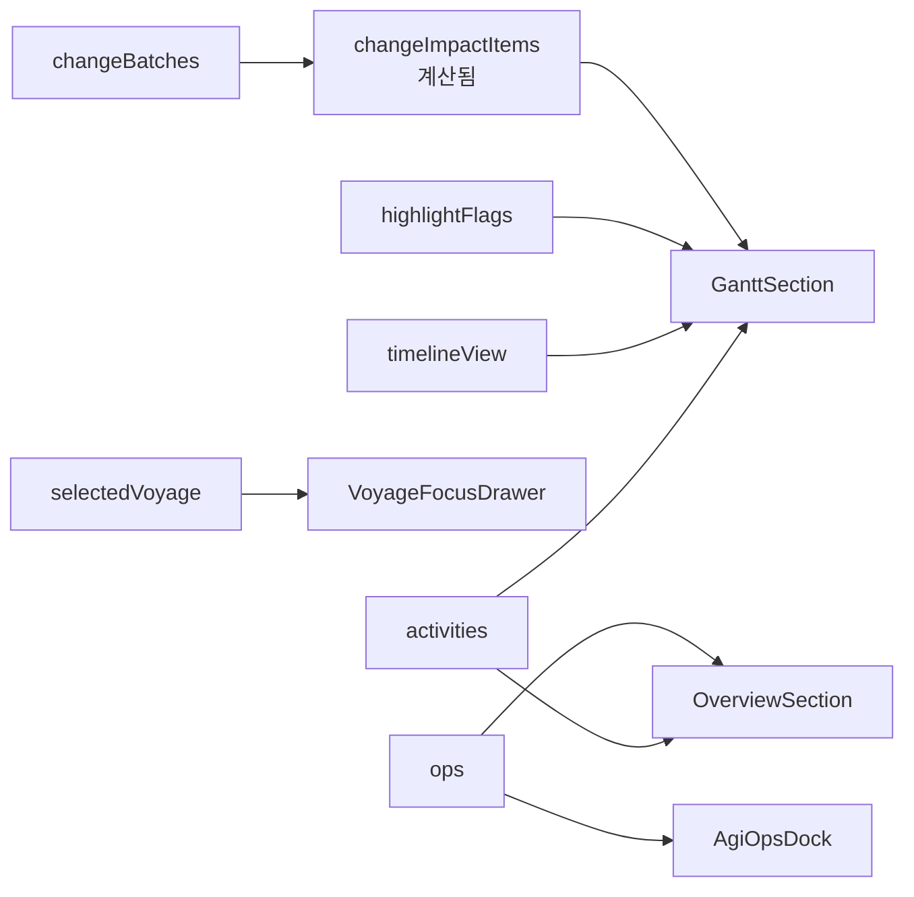
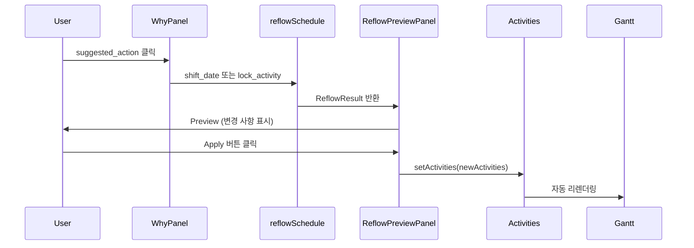

# HVDC TR Transport Dashboard - Layout 문서

> **버전**: 1.8.0  
> **최종 업데이트**: 2026-02-05  
> **최신 작업 반영**: 2026-02-05 — Gantt Reset 버튼 & Activity 디버깅 강화 (Phase 13 완료). Timeline controls에 Reset 버튼 추가, Activity 로딩 디버깅 로그. Event Sourcing Overlay Pipeline 구현 완료 (Event Log → Actual/Hold/Milestone → Gantt 오버레이. 3-PR: ID Resolution/JSON Patch/KPI Calc. Plan 불변, actual만 갱신). [WORK_LOG_20260202.md](WORK_LOG_20260202.md). Weather Overlay (Canvas z-0, Range culling, Opacity 슬라이더, UI 토글 🌦️/🌤️, RAF throttle 10fps, 테스트 2/2 ✅). [weather-overlay-implementation-plan.md](plan/weather-overlay-implementation-plan.md)  
> **프로젝트**: HVDC TR Transport Dashboard - AGI Site  
> **SSOT**: patch.md, option_c.json (AGENTS.md)

---

## 목차

1. [시스템 개요](#시스템-개요)
2. [전체 레이아웃 구조](#전체-레이아웃-구조)
3. [컴포넌트 계층 구조](#컴포넌트-계층-구조)
4. [상태 관리](#상태-관리)
5. [스타일링 시스템](#스타일링-시스템)
6. [섹션별 상세 설명](#섹션별-상세-설명)
7. [반응형 레이아웃](#반응형-레이아웃)
8. [파일 구조](#파일-구조)

---

## 시스템 개요

HVDC TR Transport Dashboard는 **Al Ghallan Island (AGI) Site**의 7개 Transformer Units 운송을 관리하는 실시간 물류 대시보드입니다.

**운영 규모**: 1 Trip당 1 TR 운송, 총 7 Trip, SPMT 1기 운영

### 핵심 특징

- **레이아웃**: patch.md §2.1 권장은 3열(Map | Timeline | Detail). **현재 구현은 2열** — 좌: Map+Detail(세로 배치), 우: Timeline (`lg:grid-cols-[1fr_2fr]`). MapLegend(TR 상태·충돌 범례), GanttLegendDrawer(범례 클릭→정의+의사결정 영향 2-click). 3열은 향후 옵션.
- **단일 시선 흐름**: Location → Schedule → Verification (3초 내 읽기). Phase 6에서 UI 가이드 문구 제거 완료 — StoryHeader 라벨은 Location/Schedule/Verification. TrThreeColumnLayout 슬롯 라벨은 "Map", "Timeline" (Phase 6 Bug #4).
- **2-click Collision UX**: 배지 → Why 패널 → Root cause + Evidence
- **Compare Mode** (patch.md §2.2): baseline vs compare delta overlay, Gantt ghost bars
- **Sticky Navigation**: 섹션 간 빠른 이동
- **Dark Mode**: Deep Ocean 테마 적용
- **AGI Operations**: 스케줄 업데이트 및 명령 처리

---

## 전체 레이아웃 구조

### 레이아웃 다이어그램 (patch.md §2.1)

```mermaid
graph TB
    RootLayout[app/layout.tsx<br/>RootLayout]
    RootLayout --> Page[app/page.tsx<br/>DateProvider + DashboardLayout]
    
    Page --> Header[DashboardHeader]
    Page --> StoryHeader[StoryHeader<br/>Location/Schedule/Verification]
    Page --> Overview[OverviewSection]
    Page --> SectionNav[SectionNav]
    Page --> TrLayout[TrThreeColumnLayout<br/>Map | Timeline | Detail]
    Page --> Footer[Footer]
    Page --> VoyageDrawer[VoyageFocusDrawer]
    
    TrLayout --> LeftCol[좌측 1열 1fr]
    LeftCol --> MapSlot[mapSlot: MapPanelWrapper + VoyagesSection]
    LeftCol --> DetailSlot[detailSlot: DetailPanel, WhyPanel, …]
    TrLayout --> TimelineSlot[우측 1열 2fr: timelineSlot<br/>ScheduleSection + GanttSection]
    
    DetailSlot --> DetailPanel[DetailPanel<br/>ActivityHeader, State, PlanVsActual, Resources, Constraints, CollisionTray]
    DetailSlot --> WhyPanel[WhyPanel<br/>2-click: root cause + suggested_actions]
    DetailSlot --> ReflowPreview[ReflowPreviewPanel<br/>onApplyAction → reflowSchedule]
    DetailSlot --> HistoryEvidence[HistoryEvidencePanel<br/>History | Evidence | Compare Diff | Trip Closeout]
    DetailSlot --> ReadinessPanel[ReadinessPanel<br/>Ready/Not Ready, milestones, missing evidence]
    DetailSlot --> NotesDecisions[NotesDecisions]
    
    style TrLayout fill:#06b6d4,color:#fff
    style DetailSlot fill:#0891b2,color:#fff
```

> **참고**: 실제 DOM에서는 HistoryEvidencePanel, ReadinessPanel, NotesDecisions는 TrThreeColumnLayout 밖, 페이지 하단(#evidence 다음)에 렌더됨.

### 페이지 구조 (위에서 아래로)

```
┌─────────────────────────────────────────────────────────┐
│ DashboardHeader (제목, DatePicker)                        │
├─────────────────────────────────────────────────────────┤
│ StoryHeader (Location / Schedule / Verification)          │
├─────────────────────────────────────────────────────────┤
│ OverviewSection (OperationOverviewRibbon, MilestoneTracker, AgiOpsDock*, AgiScheduleUpdaterBar) │
│ *AgiOpsDock: BulkAnchors 기본 숨김 (showBulkAnchors=false)                                      │
├─────────────────────────────────────────────────────────┤
│ SectionNav (Overview, KPI, Alerts, Voyages, Schedule, Gantt) │
├─────────────────────────────────────────────────────────┤
│ KPISection | AlertsSection                               │
├─────────────────────────────────────────────────────────┤
│ TrThreeColumnLayout (현재 2열: 1fr | 2fr)               │
│ ┌─────────────────────────┬──────────────────────────┐ │
│ │ 좌측 (Map + Detail)      │ 우측 (Timeline)          │ │
│ │ mapSlot: MapPanel,      │ timelineSlot:            │ │
│ │   VoyagesSection        │   ScheduleSection,       │ │
│ │ detailSlot: DetailPanel,│   GanttSection           │ │
│ │   WhyPanel,             │   (compareDelta→ghost)   │ │
│ │   ReflowPreviewPanel,   │                          │ │
│ │   (HistoryEvidencePanel은 하단 #evidence 섹션)     │ │
│ │   ReadinessPanel,       │                          │ │
│ │   NotesDecisions        │                          │ │
│ └─────────────────────────┴──────────────────────────┘ │
├─────────────────────────────────────────────────────────┤
│ Footer | BackToTop                                       │
└─────────────────────────────────────────────────────────┘
```

---

## 컴포넌트 계층 구조

### 1. RootLayout (`app/layout.tsx`)

**역할**: 최상위 HTML 구조 및 전역 설정

**주요 기능**:
- HTML 루트 요소 (`<html lang="en" className="dark">`)
- 폰트 설정 (Plus Jakarta Sans, JetBrains Mono)
- Vercel Analytics 통합
- 전역 CSS 적용

**코드 구조**:
```tsx
<RootLayout>
  <html lang="en" className="dark">
    <body>
      {children}
      <AnalyticsWrapper />
    </body>
  </html>
</RootLayout>
```

### 2. DashboardLayout (`components/layout/DashboardLayout.tsx`)

**역할**: Global Control Bar + ViewModeProvider (patch.md §2.1)

**구성**:
- GlobalControlBar: Trip/TR 선택, **View 버튼** (Phase 6 Bug #3: 클릭 시 `id="schedule"` Detailed Voyage Schedule 섹션으로 스크롤), Date Cursor, View Mode, Risk Overlay. **Phase 6 Bug #2**: API 실패/7개 미만 시 voyages 기반 fallback으로 trips/trs 7개 노출, selectedVoyage ↔ selectedTripId/selectedTrIds 동기화.
- **SyncInitialDate** (P1-1): 마운트 시 selectedDate·dateCursor를 smart initial(항차 창 내 today, 없으면 가장 가까운 voyage start)로 동기화. DateProvider + ViewModeStore와 초기 일치 유지.
- ViewModeProvider: Live/History/Approval/Compare 모드

### 3. Page Component (`app/page.tsx`)

**역할**: 메인 페이지 컴포넌트 및 상태 관리

**섹션 목록 (patchmain #2, #4)**:
- `sections`: `useMemo`로 생성, deps에 `conflicts.length`, `voyages.length`, `scheduleActivities.length` 등 반영. 단일 소스.
- 스크롤스파이: `sectionIds = sections.map(s => s.id)` — SectionNav와 동일 집합·순서. Alerts count는 **conflicts.length** 반영.

**주요 상태**:
- `activities`: 스케줄 활동 배열 (ScheduleActivity[])
- `activeSection`: 현재 활성 섹션 ID
- `timelineView`: 타임라인 뷰 모드 (Week/Month/Quarter)
- `selectedVoyage`: 선택된 항차 정보
- `selectedActivityId`: 선택된 활동 ID (DetailPanel 표시)
- `selectedCollision`: 선택된 충돌 (WhyPanel 표시)
- `reflowPreview`: Why 패널 suggested_action → reflowSchedule 결과
- `changeBatches`: 변경 이력 스택 (Undo 지원)
- `ops`: AGI Operations 상태
- `viewMode`: Live/History/Approval/Compare (ViewModeStore)

**컨테이너 설정**:
- `max-w-[1920px]`: 최대 너비 1920px (app/page.tsx 기준; layout-size-balance-verification과 동일)
- `mx-auto`: 중앙 정렬
- `px-4 sm:px-6`: 반응형 패딩
- `py-6`: 세로 패딩

### 4. DashboardHeader (`components/dashboard/header.tsx`)

**역할**: 대시보드 헤더 및 프로젝트 정보 표시

**구성 요소**:
- 제목: "HVDC TR Transport" (Ship 아이콘 포함)
- 프로젝트 정보: "AGI Site | 7 Transformer Units | LCT BUSHRA"
- 상태 배지: "Confirmed" (애니메이션 펄스)
- 완료일: "March 22, 2026"
- DatePicker: 날짜 선택 컴포넌트. **Phase 6 Bug #1**: Selected Date는 UTC 기준(YYYY-MM-DD)으로 Gantt 축과 정렬. `dateToIsoUtc`, `toUtcNoon` 사용. 라벨에 (YYYY-MM-DD), tooltip "Selected date: YYYY-MM-DD (UTC day index used for Gantt)" 표시.

**스타일링**:
- `bg-glass`: 반투명 배경
- `backdrop-blur-xl`: 블러 효과
- `shadow-glow`: 글로우 그림자
- 그라데이션 텍스트 (cyan-400 → teal-400)

### 5. OverviewSection (`components/dashboard/sections/overview-section.tsx`)

**역할**: 운영 개요 및 AGI Operations

**구성 요소**:
1. **OperationOverviewRibbon**: 충돌 카운트 표시
2. **MilestoneTracker**: 마일스톤 추적
3. **AgiOpsDock**: AGI 명령 처리 인터페이스
4. **AgiScheduleUpdaterBar**: 스케줄 업데이트 바

**Props**:
- `activities`: 스케줄 활동 배열
- `ops`: AGI Operations 상태
- `onApplyActivities`: 활동 적용 핸들러
- `onSetActivities`: 활동 설정 핸들러
- `onOpsCommand`: AGI 명령 실행 핸들러
- `onFocusActivity`: 활동 포커스 핸들러

### 6. SectionNav (`components/dashboard/section-nav.tsx`)

**역할**: 섹션 간 네비게이션 (Sticky)

**특징**:
- **patchmain #11**: 링크에 `aria-current="page"` (활성 섹션), `aria-label="Go to {label}"` 적용. 키보드 ↑↓ Enter로 섹션 이동.
- **patchmain #12**: `min-h-[3.25rem]`로 sticky 높이 고정, 레이아웃 시프트(LCP 시프트) 완화.
- `sticky top-0 z-20`: 상단 고정
- 스크롤 시 활성 섹션 자동 감지 유지
- 섹션별 카운트 표시 (KPI: 6, Alerts: conflicts.length, Voyages: 7, etc.)
- 부드러운 스크롤 이동

**섹션 목록** (page `sections`/`sectionIds`와 단일 소스):
1. Overview
2. KPI (count: 6)
3. Alerts (count: conflicts.length)
4. Voyages (count: 7)
5. Schedule (count: 활동 수)
6. Gantt

### 7. TrThreeColumnLayout (`components/dashboard/layouts/tr-three-column-layout.tsx`)

**역할**: **현재 2열 레이아웃** (patch.md §2.1 권장 3열 대비) — 좌: Map+Detail(세로 배치), 우: Timeline. UI 라벨: "Map", "Timeline" (Phase 6 Bug #4).

**실제 레이아웃 구조** (2열):
```tsx
<div className="grid flex-1 min-h-0 gap-4 lg:grid-cols-[1fr_2fr] lg:min-h-[480px]">
  <div aria-label="WHERE and DETAIL">
    <aside aria-label="Map">{mapSlot}</aside>  {/* MapPanel + MapLegend(좌하단 TR 상태·충돌 범례) */}
    <aside aria-label="DETAIL">{detailSlot}</aside>
  </div>
  <main aria-label="Timeline">{timelineSlot}</main>
</div>
```

**detailSlot 구성** (page.tsx 기준):
- DetailPanel (ActivityHeader, StateSection, PlanVsActualSection, ResourcesSection, ConstraintsSection, CollisionTray)
- WhyPanel (2-click: root_cause_code, suggested_actions)
- ReflowPreviewPanel (onApplyAction → reflowSchedule → Preview UI)

**HistoryEvidencePanel**은 현재 **TrThreeColumnLayout 밖**의 `#evidence` 섹션에 렌더됨 (하단). 구성:
- HistoryTab: Add event (note, delay, decision 등), append-only
- EvidenceTab: Add link (URL/경로), Evidence checklist. **Phase 8 T8.2**: `evidenceOverlay`(세션 내 클라이언트 증빙 오버레이) 지원; EvidenceUploadModal은 제거됨(Evidence는 링크/URL 입력만).
- CompareDiffPanel: Baseline vs Current diff 테이블 (Phase 6: Baseline snapshot / Compare as-of 표시)
- TripCloseoutForm: Trip Report Export (MD/JSON)

ReadinessPanel, NotesDecisions는 layout 하단(#evidence 섹션 다음)에 별도 렌더됨.

**반응형**:
- `lg:` 브레이크포인트 이상: 2열 Grid (1fr | 2fr)
- `lg:` 미만: 단일 컬럼

### 8. ResourceUtilizationPanel (`components/dashboard/resource-utilization-panel.tsx`)

**역할**: 좌측 패널 - 자원 활용도 및 필터링. **현재 page.tsx에서 미사용** (선택적/향후 사용).

**기능**:
- 자원별 활동 카운트 표시
- 활용도 퍼센트 표시
- 자원 필터링 (클릭 시 필터 적용)
- Reset 버튼 (필터 초기화)

**스타일링**:
- `sticky top-24`: 상단에서 24px 고정
- `bg-card/80`: 반투명 카드 배경
- `backdrop-blur-lg`: 블러 효과

### 9. NotesDecisions (`components/dashboard/notes-decisions.tsx`)

**역할**: 우측 패널 - 노트 및 결정사항

**기능**:
- 접기/펼치기 토글
- 노트 목록 표시
- 타임스탬프 표시

**데이터 구조** (현재 하드코딩):
```tsx
const notes = [
  { title: "Weather window", detail: "...", time: "Today" },
  { title: "Port congestion", detail: "...", time: "Jan 21" },
  { title: "Crew rotation", detail: "...", time: "Jan 20" },
]
```

---

## 상태 관리

### Page Component 상태

```tsx
// 스케줄 데이터
const [activities, setActivities] = useState(scheduleActivities)

// UI 상태
const [activeSection, setActiveSection] = useState("overview")
const [timelineView, setTimelineView] = useState<TimelineView>("Week")
const [highlightFlags, setHighlightFlags] = useState<HighlightFlags>({...})
const [selectedVoyage, setSelectedVoyage] = useState<...>(null)

// 변경 이력
const [changeBatches, setChangeBatches] = useState<ChangeBatch[]>([])

// AGI Operations
const [ops, setOps] = useState(() => createDefaultOpsState(...))
```

### 상태 흐름



### 자동 계산 로직

**충돌 감지** (`useEffect`):
```tsx
useEffect(() => {
  setConflicts(detectResourceConflicts(activities))
}, [activities])
```

**변경 이력 플래튼화** (`useMemo`):
```tsx
const changeImpactItems = useMemo(() => {
  const flattened = changeBatches.flatMap((batch) =>
    batch.changes.map((change) => ({
      ...change,
      appliedAt: batch.appliedAt,
    }))
  )
  return flattened.slice(-MAX_CHANGE_STACK).reverse()
}, [changeBatches])
```

**섹션 목록·스크롤스파이 (patchmain #2, #4)**:
- `sections`: `useMemo(deps: [conflicts.length, voyages.length, scheduleActivities.length, ...])` — 단일 소스.
- `sectionIds = sections.map(s => s.id)` — ScrollSpy·SectionNav와 동일 집합·순서 (derived).

**활성 섹션 감지** (`useEffect`, `sectionIds` 사용):
```tsx
useEffect(() => {
  const ids = sectionIds  // sections.map(s => s.id) — 단일 소스
  const handler = () => {
    const scrollPosition = window.scrollY + 120
    let current = ids[0]
    for (const id of ids) {
      const el = document.getElementById(id)
      if (el && el.offsetTop <= scrollPosition) {
        current = id
      }
    }
    setActiveSection(current)
  }
  handler()
  window.addEventListener("scroll", handler)
  return () => window.removeEventListener("scroll", handler)
}, [sectionIds])
```

---

## 스타일링 시스템

### 테마: Deep Ocean

**색상 팔레트** (OKLCH):
- **Background**: `oklch(0.12 0.02 250)` - 어두운 바다색
- **Foreground**: `oklch(0.95 0.01 250)` - 밝은 텍스트
- **Primary**: `oklch(0.72 0.15 195)` - Cyan/Teal
- **Accent**: `oklch(0.72 0.15 195 / 0.15)` - 반투명 Cyan

**폰트**:
- **Sans**: Plus Jakarta Sans
- **Mono**: JetBrains Mono

### 커스텀 유틸리티 클래스

```css
.bg-glass {
  background: rgba(30, 41, 59, 0.6);
  backdrop-filter: blur(20px);
}

.shadow-glow {
  box-shadow: 0 0 40px rgba(6, 182, 212, 0.15);
}

.shadow-cyan {
  box-shadow: 0 4px 20px rgba(6, 182, 212, 0.35);
}
```

### 배경 효과

**그리드 패턴**:
```css
body::before {
  background-image: 
    linear-gradient(rgba(6, 182, 212, 0.03) 1px, transparent 1px),
    linear-gradient(90deg, rgba(6, 182, 212, 0.03) 1px, transparent 1px);
  background-size: 60px 60px;
}
```

**그라데이션 배경**:
```css
body {
  background: linear-gradient(145deg, #0a0f1a 0%, #0c1929 40%, #0f172a 100%);
}
```

### 스크롤바 커스터마이징

```css
::-webkit-scrollbar {
  width: 8px;
  height: 8px;
}

::-webkit-scrollbar-thumb {
  background: #0891b2;
  border-radius: 4px;
}
```

---

## 섹션별 상세 설명

### 1. Overview Section (`id="overview"`)

**위치**: Header 바로 아래

**구성 요소**:
1. **OperationOverviewRibbon**
   - 상태 요약 표시

2. **MilestoneTracker**
   - 프로젝트 마일스톤 추적
   - 진행률 표시

3. **AgiOpsDock**
   - AGI 명령 처리 인터페이스
   - BulkAnchors 기본 숨김 (showBulkAnchors=false)
   - 활동 검색 및 필터링, 활동 포커스 기능

4. **AgiScheduleUpdaterBar**
   - 스케줄 업데이트 명령 입력
   - 변경사항 미리보기
   - 적용/취소 기능

### 2. KPI Section (`id="kpi"`)

**위치**: SectionNav 아래, 메인 콘텐츠 영역 첫 번째 (DashboardShell은 현재 page.tsx에서 미사용 — 레이아웃 래퍼: children + 우측 NotesDecisions 240px)

**구성 요소**:
- **KPICards**: 6개의 KPI 카드
  - 각 카드는 메트릭, 트렌드, 상태 표시

### 3. Alerts Section (`id="alerts"`)

**위치**: KPI Section 아래

**구성 요소**:
- **AlertsTriage**: 알림 트리지 시스템
  - **GoNoGoBadge**: Sea Transit Go/No-Go 결정 (GO|NO-GO|CONDITIONAL)
    - 데이터: `data/schedule/go_nogo.json`
  - **WeatherBlock**: Weather & Marine Risk (4일치 D~D+3, Last Updated)
    - 데이터: `data/schedule/weather.json`
  - **OperationalNotice**: 운영 공지
  - 우선순위별 분류, 알림 카운트 표시

### 4. Voyages Section (`id="voyages"`)

**위치**: Alerts Section 아래

**구성 요소**:
- **VoyageCards**: 7개 항차 카드
  - 각 항차별 정보 표시
  - 클릭 시 VoyageFocusDrawer 열림
- **TideTable**: 각 VoyageCard 하단에 물때 상위 3시간대 표시
  - 데이터: `data/schedule/tide.json` (WATER TIDE.csv 파싱 결과)
  - 형식: 3행 `HH:00` / `X.XXm` (DASHBOARD_OUTPUT_SCHEMA)

**상호작용**:
- 항차 카드 클릭 → `setSelectedVoyage(voyage)`
- VoyageFocusDrawer 표시

### 5. Schedule Section (`id="schedule"`)

**위치**: Voyages Section 아래. **Phase 6 Bug #3**: GlobalControlBar View 버튼 클릭 시 이 섹션(`id="schedule"`)으로 스크롤.

**구성 요소**:
- **ScheduleTable**: 스케줄 테이블
  - 활동 목록 표시, 날짜/시간 정보, 자원 태그 표시
  - **Phase 6 Bug #2**: 날짜 필터 결과 0개 시 전체 7개 TR fallback 표시 (schedule-table fallback)
  - **patchmain #9** ("0 of 7 visible" 방지): 필터 결과 0건이면 `displayVoyages = voyages`로 전체 표시 + 안내 문구 "Selected date is outside all voyage windows. Showing all voyages."

### 6. Gantt Section (`id="gantt"`)

**위치**: Schedule Section 아래 (마지막)

**구성 요소**:
1. **TimelineControls**
   - 뷰 모드 전환 (Week/Month/Quarter)
   - 하이라이트 플래그 토글
   - 날짜 점프 기능
   - **Zoom/Pan Controls** (vis-timeline 사용 시):
     - Zoom In/Out (+ / -)
     - Pan Left/Right (← / →)
     - Fit All (⊡)
     - Today (현재 날짜로 이동)
     - **Reset (⟲)** (Phase 13, 2026-02-05): 
       - Gantt 전체 리셋 버튼 (주황색 hover)
       - View → Day, 모든 필터/하이라이트 비활성화
       - 모든 TR 그룹 펼치기, Event overlays/Heatmap 비활성화
       - Timeline fit (전체 보기)
       - `handleResetGantt()` in `gantt-chart.tsx`

2. **GanttChart**
   - 타임라인 차트. **조건부 엔진**: `NEXT_PUBLIC_GANTT_ENGINE=vis` 시 `VisTimelineGantt`(vis-timeline), 미설정 시 CSS/SVG 커스텀 Gantt. Vis 사용 시 Day/Week 뷰, Selected Date 커서(UTC), 6종 액티비티 모두 막대(bar) 표시(동일일 최소 1일 길이). 환경에 따른 엔진 선택 로직은 `components/dashboard/gantt-chart.tsx`의 `useVisEngine`(process.env).
   - 활동 바 표시. **UX**: 액티비티 클릭 → 해당 항목으로 스크롤(`scrollToActivity`) + `#gantt` 섹션 `scrollIntoView`; 액티비티 **드래그로 일정 이동** 가능(editable, itemsAlwaysDraggable).
   - **Phase 6 Bug #1**: Selected Date는 UTC 기준(YYYY-MM-DD). `formatShortDateUtc`, `getDatePosition(toUtcNoon(date))` 사용. Gantt 날짜 축과 정렬.
   - **compareDelta** (Phase 10): Compare 모드 시 ghost bars (changed 활동 노란 점선)
   - **GanttLegendDrawer** (P1-4): 범례 태그 클릭 시 우측 Drawer에 정의·의사결정 영향 표시. `lib/gantt-legend-guide.ts`의 LegendDefinition(stage/constraint/collision/meta) 기반. 2-click 내 도달.
   - **A3 Mapper Caching (2026-02-04)**: Row-level 캐시 (LRU 200), `visTimelineMapper.ts`. 1개 row 변경 시 1개만 재계산, 재렌더링 30% 개선.
   - **B5 Dependency Type (2026-02-04)**: FS/SS/FF/SF 타입별 시각화, `DependencyArrowsOverlay.tsx` (SVG overlay, z-10). Live DOM 좌표, 4가지 스타일 구분, Lag 라벨. ResizeObserver + RAF throttle. `VisTimelineGantt` rangechange/changed callbacks 동기화.
   - **Weather Overlay (2026-02-04)**: ✅ **구현 완료** - Canvas 배경 레이어 (z-0), NO_GO/NEAR_LIMIT 시각화, Opacity 슬라이더 (5-40%), UI 토글 (🌦️/🌤️), Range culling, RAF throttle (10fps), DPI 2x. `WeatherOverlay.tsx`, `weather-overlay.ts`, `weather-overlay.test.ts` (테스트 2/2 passed).
   - **Event Overlays (Phase 12, 2026-02-05)**: ✅ **구현 완료**
     - **Actual Bar**: START/END 이벤트 기반, variance class (On Time/Early/Delayed)
     - **HOLD Period**: HOLD/RESUME 페어링, reason_tag 구분 (Weather/PTW/Berth/MWS)
     - **MILESTONE Marker**: ARRIVE/DEPART 포인트 (A/D 심볼)
     - **UI Toggles**: Show Actual/Hold/Milestone (timeline-controls)
     - **Overlay Legend**: 조건부 범례 표시 (Actual/Hold/Milestone 스타일)
     - **Event Log Loader**: localStorage cache (1-hour TTL) + `/data/event-logs/sample_events.json` fallback
     - **Mapper**: `lib/gantt/event-sourcing-mapper.ts` (Activity + Events → Enhanced VisItems)
   - 스크롤 및 줌 기능

**Props** (실제 코드 기준):
- `ganttRef`: GanttChart ref (scrollToActivity 등)
- `activities`: 스케줄 활동 배열
- `view`, `onViewChange`: 타임라인 뷰 모드
- `highlightFlags`, `onHighlightFlagsChange`: 하이라이트 플래그
- `jumpDate`, `onJumpDateChange`, `jumpTrigger`, `onJumpRequest`: 날짜 점프
- `onActivityClick`, `onActivityDeselect`: 활동 선택
- `conflicts`, `onCollisionClick`: 충돌 표시 및 2-click UX
- `focusedActivityId`: 포커스된 활동
- `compareDelta`: Compare 모드 시 ghost bars용
- `projectEndDate`: 프로젝트 종료일

---

## 반응형 레이아웃

### 브레이크포인트

**Desktop (lg 이상, ≥1024px)**:
- 2-Column Grid: `1fr (Map+Detail) | 2fr (Timeline)`
- 모든 패널 표시
- Sticky 패널 활성화

**Tablet (md, 768px~1023px)**:
- lg 미만 시 grid 단일 컬럼
- 패널 축소 또는 숨김

**Mobile (sm 이하, <768px)**:
- 단일 컬럼 레이아웃
- 패널 접기/펼치기
- 터치 최적화

### Sticky 요소

1. **SectionNav**: `sticky top-0 z-20`
2. **ResourceUtilizationPanel**: `sticky top-24`
3. **NotesDecisions**: `sticky top-24`

### 컨테이너 너비

- **최대 너비**: `1920px` (`max-w-[1920px]`, app/page.tsx 기준)
- **중앙 정렬**: `mx-auto`
- **패딩**: `px-4 sm:px-6` (모바일: 16px, 데스크톱: 24px)

---

## 파일 구조

```
app/
├── layout.tsx              # RootLayout
├── page.tsx                # Page Component (메인)
├── globals.css             # 전역 스타일
└── api/
    └── ssot/
        └── route.ts        # SSOT API

components/
├── layout/
│   └── DashboardLayout.tsx  # GlobalControlBar + ViewModeProvider
├── control-bar/
│   └── GlobalControlBar.tsx # Trip/TR, Date Cursor, View Mode, Risk Overlay (DashboardLayout에서 사용)
├── dashboard/
│   ├── header.tsx
│   ├── StoryHeader.tsx
│   ├── section-nav.tsx
│   ├── footer.tsx
│   ├── back-to-top.tsx
│   ├── voyage-focus-drawer.tsx
│   ├── layouts/
│   │   ├── dashboard-shell.tsx   # children + NotesDecisions (현재 page에서 미사용)
│   │   └── tr-three-column-layout.tsx  # 2열: Map+Detail | Timeline
│   ├── sections/
│   │   ├── overview-section.tsx
│   │   ├── kpi-section.tsx
│   │   ├── alerts-section.tsx
│   │   ├── voyages-section.tsx
│   │   ├── schedule-section.tsx
│   │   └── gantt-section.tsx
│   ├── WhyPanel.tsx
│   ├── ReflowPreviewPanel.tsx
│   ├── ReadinessPanel.tsx
│   ├── SyncInitialDate.tsx  # P1-1: DateProvider·ViewModeStore 초기 날짜 동기화
│   ├── GanttLegendDrawer.tsx # P1-4: 범례 클릭 시 정의·의사결정 영향 Drawer
│   ├── notes-decisions.tsx
│   ├── gantt-chart.tsx
│   ├── resource-utilization-panel.tsx  # 미사용 (선택적)
│   └── ...
├── ops/                    # AGI Operations (OverviewSection에서 사용)
│   ├── AgiOpsDock.tsx
│   ├── AgiCommandBar.tsx
│   ├── AgiConflictsPanel.tsx
│   ├── AgiDiffTable.tsx
│   ├── AgiPreviewDrawer.tsx
│   └── ...
├── gantt/
│   ├── VisTimelineGantt.tsx
│   └── ResourceConflictsPanel.tsx
├── detail/
│   ├── DetailPanel.tsx
│   ├── CollisionTray.tsx
│   ├── CollisionCard.tsx
│   └── sections/
│       ├── ActivityHeader.tsx
│       ├── StateSection.tsx
│       ├── PlanVsActualSection.tsx
│       ├── ResourcesSection.tsx
│       └── ConstraintsSection.tsx
├── history/
│   ├── HistoryEvidencePanel.tsx  # History | Evidence | Compare Diff | Trip Closeout
│   ├── HistoryTab.tsx
│   ├── TripCloseoutForm.tsx
│   └── ...
├── evidence/
│   └── EvidenceTab.tsx     # Evidence checklist, Add link (URL), evidenceOverlay
├── compare/
│   ├── CompareDiffPanel.tsx
│   └── CompareModeBanner.tsx
├── map/
│   ├── MapPanelWrapper.tsx
│   ├── MapPanel.tsx
│   ├── MapContent.tsx
│   └── MapLegend.tsx        # TR 상태·충돌 범례 (patch §4.1, 좌하단 오버레이)
├── approval/
│   └── ApprovalModeBanner.tsx
└── ...
lib/
├── contexts/
│   └── date-context.tsx    # DateProvider (page.tsx에서 사용)
├── data/
│   ├── go-nogo-data.ts
│   ├── schedule-data.ts
│   ├── tide-data.ts
│   └── weather-data.ts
├── ssot/
│   ├── schedule.ts
│   ├── evidence-gate.ts
│   ├── history-events.ts
│   ├── map-status-colors.ts
│   ├── reflow-runs.ts
│   ├── timeline-badges.ts
│   ├── view-mode-permissions.ts
│   └── utils/
│       └── schedule-mapper.ts
├── utils/
│   ├── schedule-reflow.ts
│   ├── slack-calc.ts
│   ├── detect-resource-conflicts.ts
│   ├── infer-dependencies.ts
│   ├── reflow-engine.ts
│   └── utils.ts
├── baseline/
│   ├── baseline-compare.ts
│   ├── baseline-loader.ts
│   ├── freeze-policy.ts
│   ├── snapshot-hash.ts
│   └── types.ts
├── store/
│   └── trip-store.ts
├── reports/
│   └── trip-report.ts
├── compare/
│   ├── compare-loader.ts
│   ├── types.ts
│   └── __tests__/compare-loader.test.ts
├── gantt/
│   ├── visTimelineMapper.ts
│   ├── gantt-contract.ts
│   ├── contract.schema.json
│   └── ...
├── ops/                    # AGI schedule/ops 로직
│   ├── agi/
│   │   ├── adapters.ts
│   │   ├── applyShift.ts
│   │   ├── parseCommand.ts
│   │   └── ...
│   └── agi-schedule/
│       ├── go-no-go.ts
│       ├── shift.ts
│       ├── pipeline-runner.ts
│       └── ...
├── gantt-legend-guide.ts    # P1-4: Gantt 범례 정의 (LegendDefinition, stage/constraint/collision)
└── dashboard-data.ts

files/
└── map/                     # 지도 번들·히트맵·지오펜스 참조용 (map-integration-ideas.md)
    ├── bundle-geofence-heatmap-eta/
    ├── HeatmapLegend.tsx
    ├── HvdcPoiLayers.ts
    ├── MapView.tsx
    ├── PoiLocationsLayer.ts
    └── layers/
```

---

## 주요 상호작용

### 1. 섹션 네비게이션

- **SectionNav 클릭** → 해당 섹션으로 스크롤
- **스크롤** → 활성 섹션 자동 감지 및 하이라이트

### 2. 항차 선택

- **VoyageCard 클릭** → VoyageFocusDrawer 열림
- **Drawer 닫기** → `setSelectedVoyage(null)`

### 3. Activity 선택 (Phase 7)

- **Timeline Activity 클릭** → `selectedActivityId` 설정
- **DetailPanel 표시** → ActivityHeader, State, Plan vs Actual, Resources, Constraints, Collision Tray
- **Map 마커 클릭** → 동일한 Activity 선택 (상호 하이라이트)

### 4. Collision 2-Click UX (Phase 7)

**1클릭: Collision 배지**
- **CollisionTray** 또는 **Timeline 배지** 클릭
- WhyPanel 표시 (root_cause_code, description, suggested_actions)

**2클릭: Suggested Action**
- WhyPanel에서 suggested_action 클릭
- `onApplyAction` 핸들러 실행 → reflowSchedule 호출
- ReflowPreviewPanel 표시 (변경 사항 + 새로운 충돌)

### 5. Gantt 범례 2-Click (P1-4)

- **범례 태그 클릭** → GanttLegendDrawer 열림 (정의·의사결정 영향)
- `lib/gantt-legend-guide.ts`의 LegendDefinition (stage/constraint/collision/meta) 기반

### 6. Reflow Preview → Apply (Phase 7)



### 7. 스케줄 업데이트

- **AgiScheduleUpdaterBar** → 명령 입력
- **미리보기** → 변경사항 확인
- **적용** → `handleApplyPreview` 실행
- **변경 이력** → `changeBatches`에 추가

### 8. 변경 취소 (Undo)

- **GanttSection** → `onUndoChangeImpact` 호출
- **이전 상태 복원** → `lastBatch.previousActivities` 적용
- **최대 스택**: MAX_CHANGE_STACK (기본 20개)

### 9. View Mode 전환 (Phase 4)

- **Global Control Bar** → View Mode 버튼 (Live/History/Approval/Compare)
- **ViewModeStore** → 전역 상태 업데이트
- **조건부 렌더링**: Approval 모드 → Apply 버튼 비활성화, Compare 모드 → ghost bars 표시

---

## 접근성 (Accessibility)

### 키보드 네비게이션

- **Skip to Content**: `#main`으로 바로 이동
- **섹션 네비게이션**: Tab 키로 이동, Enter로 선택. **patchmain #11**: SectionNav 링크에 ↑↓ 키보드로 섹션 이동, Enter로 선택.

### ARIA 레이블 (patchmain #11)

- `<section id="overview" aria-label="Operation Overview">`
- `<nav aria-label="Section navigation">`
- SectionNav 링크: `aria-current="page"` (활성 섹션), `aria-label="Go to {label}"`
- `<main id="main">`

### 포커스 관리

- 포커스 가능한 요소에 명확한 포커스 스타일
- 모달/드로어 열림 시 포커스 트랩

---

## 성능 최적화

### 메모이제이션 (patchmain #2, #4)

- `changeImpactItems`: `useMemo`로 계산 최적화
- `sections`: `useMemo`로 섹션 목록 캐싱 (deps: conflicts.length, voyages.length, scheduleActivities.length 등)
- `sectionIds`: `sections.map(s => s.id)` — derived, ScrollSpy·SectionNav 단일 소스
- `resourceStats`: `useMemo`로 자원 통계 계산

### 렌더링 최적화

- 조건부 렌더링: `{selectedVoyage && <VoyageFocusDrawer />}`
- Sticky 요소: CSS로 처리 (JavaScript 최소화)

### 상태 업데이트

- 스크롤 이벤트: 디바운싱/쓰로틀링 (필요 시)

---

## 향후 개선 사항

1. **반응형 레이아웃 강화**
   - Tablet/Mobile 레이아웃 명시적 정의
   - 터치 제스처 지원

2. **상태 관리 개선**
   - Context API 또는 상태 관리 라이브러리 도입 검토
   - 전역 상태와 로컬 상태 분리

3. **성능 최적화**
   - 가상화 (Virtual Scrolling) 적용
   - 이미지/차트 지연 로딩

4. **접근성 강화**
   - 스크린 리더 테스트
   - 키보드 단축키 추가

5. **테스트**
   - 컴포넌트 단위 테스트
   - 통합 테스트
   - E2E 테스트

---

## 에이전트 스킬 통합

에이전트 `agi-schedule-updater`와 4개 스킬의 출력이 본 레이아웃에 반영되도록 하려면 `docs/AGENT_DASHBOARD_INTEGRATION.md`를 참조한다. DASHBOARD_OUTPUT_SCHEMA → LAYOUT 섹션 매핑 및 동기화 경로가 정의되어 있다.

---

## 참고 자료

- [Next.js App Router 문서](https://nextjs.org/docs/app)
- [Tailwind CSS 문서](https://tailwindcss.com/docs)
- [React Hooks 문서](https://react.dev/reference/react)
- [Mermaid 다이어그램](https://mermaid.js.org/)

---

**문서 작성일**: 2025-01-31  
**최종 업데이트**: 2026-02-05 (Phase 12 Event Sourcing Overlay 반영)  
**프로젝트**: HVDC TR Transport Dashboard  

## Refs

- [patch.md](../patch.md) §2.1, §2.2, §4.2
- [AGENTS.md](../AGENTS.md)
- [README.md](../README.md) — 프로젝트 개요
- [plan_patchmain_14.md](plan/plan_patchmain_14.md) — patchmain 14-item (2026-02-04)
- [WORK_LOG_20260202.md](WORK_LOG_20260202.md) — Phase 6/7/10/11, 2026-02-04 patchmain 작업 요약
- [BUGFIX_APPLIED_20260202.md](BUGFIX_APPLIED_20260202.md) — Bug #1~5,#7 적용
- [map-integration-ideas.md](plan/map-integration-ideas.md) — 지도 번들·히트맵·지오펜스 통합 아이디어
