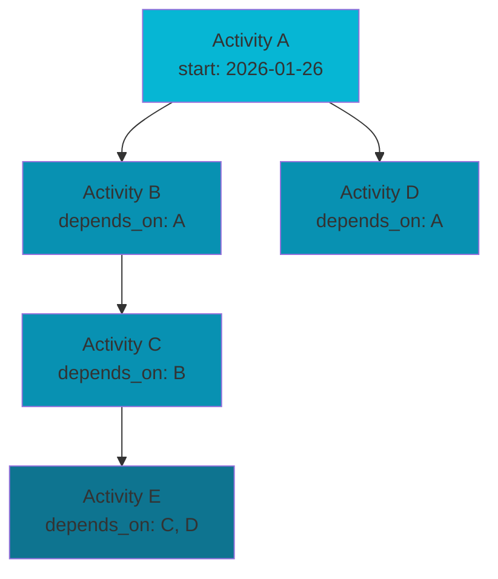

# HVDC TR Transport Dashboard - 시스템 아키텍처

**버전**: 1.6  
**최종 업데이트**: 2026-02-04  
**최신 작업 반영**: 2026-02-04 — Weather Overlay 구현 완료 (Canvas z-0, Range culling, Opacity 슬라이더 5-40%, UI 토글 🌦️/🌤️, RAF throttle 10fps, DPI 2x, 테스트 2/2 ✅). [weather-overlay-implementation-plan.md](plan/weather-overlay-implementation-plan.md), [WORK_LOG_20260202](WORK_LOG_20260202.md), [LAYOUT.md](LAYOUT.md)  
**프로젝트**: HVDC TR Transport - AGI Site Logistics Dashboard  
**SSOT**: patch.md, option_c.json (AGENTS.md)

---

## 목차

1. [시스템 개요](#시스템-개요)
2. [아키텍처 원칙](#아키텍처-원칙)
3. [레이어 구조](#레이어-구조)
4. [데이터 흐름](#데이터-흐름)
5. [핵심 컴포넌트](#핵심-컴포넌트)
6. [상태 관리](#상태-관리)
7. [의존성 그래프](#의존성-그래프)
8. [성능 최적화](#성능-최적화)
9. [확장성 고려사항](#확장성-고려사항)
10. [Mermaid 레퍼런스](#mermaid-레퍼런스)

---

## 시스템 개요

### 목적

HVDC TR Transport Dashboard는 **7개의 Transformer Unit**을 **LCT BUSHRA**로 운송하는 프로젝트의 실시간 물류 대시보드입니다. 복잡한 스케줄 의존성을 관리하고, 일정 변경의 영향을 실시간으로 시각화합니다.

**운영 규모**: 1 Trip당 1 TR 운송, 총 7 Trip, SPMT 1기 운영

### 핵심 요구사항

- **실시간 스케줄 관리**: 139개 활동의 의존성 기반 자동 재계산
- **시각적 일정 표시**: Gantt 차트를 통한 7개 항차 타임라인
- **변경 영향 분석**: 일정 변경 시 영향받는 작업 자동 계산
- **불변성 보장**: 원본 데이터 보호 및 안전한 상태 업데이트

### 최근 반영 (Phase 6/7/10/11) — 본문 반영

| Phase | 반영 내용 (본문과 일치하도록 유지) |
|-------|-----------------------------------|
| **Phase 6 Bug #1** | Selected Date UTC 정렬: `lib/ssot/schedule.ts`의 `dateToIsoUtc`, `toUtcNoon`. Gantt/DatePicker는 UTC 기준(YYYY-MM-DD)으로 축과 정렬. |
| **Phase 6 Bug #2** | Trip/TR 필터: API 실패/7개 미만 시 voyages 기반 fallback. `selectedVoyage` ↔ `selectedTripId`/`selectedTrIds` 동기화. schedule-table 0개 시 7개 fallback. |
| **Phase 6 Bug #3** | GlobalControlBar View 버튼: 클릭 시 `id="schedule"` Detailed Voyage Schedule로 스크롤. |
| **Phase 6 Bug #4** | StoryHeader·3열: WHERE/WHEN/WHAT/EVIDENCE 제거 → Location/Schedule/Verification, Map/Timeline. |
| **Phase 6 Bug #5** | CompareDiffPanel: 상단에 "Baseline snapshot: (created_at) (immutable)", "Compare as-of: Live (current state)" 표시. |
| **Phase 7** | DetailPanel 구조화, CollisionTray, Why 패널 suggested_actions → reflowSchedule 연결. ReflowPreviewPanel 연동. |
| **Phase 8 T8.2** | Evidence checklist, EvidenceUploadModal, evidenceOverlay (HistoryEvidencePanel). |
| **Phase 10** | Compare Mode: compare-loader, CompareModeBanner, Gantt ghost bars (compareDelta). |
| **Phase 11** | T11.2 Cycle detection, T11.3 Evidence gate, T11.4 E2E workflow 테스트 완료. |
| **2026-02-04 patchmain** | sections/sectionIds 단일 소스, ScrollSpy·SectionNav 일원화. pipeline-check 순수 함수·null/empty 안전 (patchmain #13). Day Number 정수, Schedule 기본 표시, SectionNav a11y·sticky, Vitest pipeline-check. |
| **P1-1 SyncInitialDate** | `lib/dashboard-data.ts`의 `getSmartInitialDate()`: 오늘·항차 창·가장 가까운 voyage start 계산. `DashboardLayout` 마운트 시 `DateProvider`·`ViewModeStore`(dateCursor) 초기 동기화. |
| **P1-4 GanttLegendDrawer** | 범례 태그 클릭 → 우측 Drawer에 정의·의사결정 영향 표시. `lib/gantt-legend-guide.ts`(LegendDefinition: stage/constraint/collision/meta) 기반. 2-click 내 도달. |
| **MapLegend** | `MapPanel` 좌하단 오버레이. TR 상태(Planned/Ready/In progress/Completed/Blocked/Delayed) 색상·충돌(Blocking/Warning) 배지. patch §4.1, `lib/ssot/map-status-colors.ts` 연동. |
| **Vis Gantt 패치·UX** | [visganttpatch.md](../visganttpatch.md) 참조. `gantt-chart.tsx`의 `useVisEngine`(= `NEXT_PUBLIC_GANTT_ENGINE` trim/toLowerCase `"vis"`)으로 vis-timeline(VisTimelineGantt) vs 자체 렌더 전환. `.env.local` 예: `NEXT_PUBLIC_GANTT_ENGINE=vis`, `PORT=3001`. `lib/gantt/visTimelineMapper.ts`: GanttRow → Vis groups/items, 동일일 막대 보정(min 1-day). VisTimelineGantt: DataSet, customTime(Selected Date), editable/draggable. 액티비티 클릭 → scrollToActivity + #gantt scrollIntoView. |

---

## 아키텍처 원칙

### 1. SSOT (Single Source of Truth)

**목적**: 데이터 중복 제거 및 일관성 보장

**구현**:
- 타입 정의: `lib/ssot/schedule.ts` - 모든 스케줄 관련 타입의 단일 정의
- 데이터 로더: `lib/data/schedule-data.ts` - `data/schedule/option_c.json`의 단일 진입점
- 중복 금지: 동일 enum/상수를 여러 파일에 정의하지 않음

**예시**:
```typescript
// ✅ 올바른 방법: SSOT에서 import
import { ScheduleActivity, AnchorType } from "@/lib/ssot/schedule"

// ❌ 잘못된 방법: 로컬에서 재정의
type ScheduleActivity = { ... } // 중복 정의 금지
```

### 2. 계산 vs 렌더링 분리

**목적**: 순수 함수로 테스트 가능성 및 재사용성 향상

**구현**:
- **계산 로직**: `lib/utils/*`, `src/lib/reflow/*` - 순수 함수만 포함
  - `lib/utils/schedule-reflow.ts`: 스케줄 재계산 공개 API (reflowSchedule)
  - `lib/ssot/utils/schedule-mapper.ts`: 데이터 변환 (TR Unit, Anchor 타입 추출)
- **UI 렌더링**: `components/*` - 계산 로직 금지
  - `gantt-chart.tsx`: 시각화만 담당
  - `ReflowPreviewPanel.tsx`: Preview UI 표시만 담당

**예시**:
```typescript
// ✅ 올바른 방법: 계산 로직 분리
const result = reflowSchedule(activities, activityId, newDate, options)
setActivities(result.activities)

// ❌ 잘못된 방법: 컴포넌트 내부에서 계산
function GanttChart() {
  // 계산 로직을 컴포넌트 내부에 작성하지 않음
}
```

### 3. 컴포넌트 책임 분리

**목적**: 단일 책임 원칙 준수 및 유지보수성 향상

**구조**:
- **조립자 (Orchestrator)**: `app/page.tsx`
  - 섹션 컴포넌트 import만 수행
  - 상태 관리 및 이벤트 핸들링
- **섹션 컴포넌트**: `components/dashboard/sections/*`
  - 특정 섹션의 렌더링만 담당
  - props를 통한 데이터 수신
- **유틸 함수**: `lib/utils/*`
  - 순수 함수로 구현
  - 사이드 이펙트 없음

---

## 레이어 구조

```
┌─────────────────────────────────────────────────────────┐
│                    Presentation Layer                    │
│  ┌──────────────┐  ┌──────────────┐  ┌──────────────┐ │
│  │   app/       │  │ components/  │  │   public/    │ │
│  │  page.tsx    │  │  dashboard/  │  │   assets     │ │
│  │  layout.tsx  │  │  gantt/      │  │              │ │
│  └──────────────┘  └──────────────┘  └──────────────┘ │
└─────────────────────────────────────────────────────────┘
                          │
                          ▼
┌─────────────────────────────────────────────────────────┐
│                     Business Logic Layer                 │
│  ┌──────────────┐  ┌──────────────┐  ┌──────────────┐ │
│  │ reflow       │  │ data·ssot    │  │ ops·contexts │ │
│  │ lib/utils/   │  │ lib/data/    │  │ lib/ops/agi  │ │
│  │ schedule-    │  │ schedule-    │  │ agi-schedule │ │
│  │ reflow +     │  │ go-nogo,     │  │ lib/contexts │ │
│  │ src/lib/     │  │ tide, weather│  │ lib/gantt     │ │
│  │ reflow       │  │ lib/ssot/    │  │              │ │
│  │ lib/ssot/    │  │ utils/       │  │              │ │
│  │ utils/mapper │  │ schedule-data│  │              │ │
│  └──────────────┘  └──────────────┘  └──────────────┘ │
└─────────────────────────────────────────────────────────┘
                          │
                          ▼
┌─────────────────────────────────────────────────────────┐
│                      Data Layer                          │
│  ┌──────────────────┐  ┌─────────────────────────────┐  │
│  │ lib/ssot/        │  │ data/schedule/option_c.json│  │
│  │ schedule.ts      │  │ (139 activities)            │  │
│  │ (types)          │  │                             │  │
│  └──────────────────┘  └─────────────────────────────┘  │
└─────────────────────────────────────────────────────────┘
```

### 레이어별 책임

#### 1. Presentation Layer
- **역할**: 사용자 인터페이스 렌더링
- **구성요소**:
  - `app/page.tsx`: 메인 페이지 조립자
  - `components/dashboard/*`: 대시보드 섹션 컴포넌트
  - `components/dashboard/SyncInitialDate.tsx`: P1-1 — 마운트 시 DateProvider·ViewModeStore 초기 날짜 동기화
  - `components/dashboard/GanttLegendDrawer.tsx`: P1-4 — 범례 클릭 시 정의·의사결정 영향 Drawer
  - `components/gantt/*`: Gantt 차트 관련 컴포넌트
  - `components/map/*`: MapPanel, MapContent, MapLegend (TR 상태·충돌 범례)
  - `components/layout/DashboardLayout.tsx`: GlobalControlBar + SyncInitialDate + ViewModeProvider
- **특징**: 계산 로직 없음, props 기반 데이터 수신

#### 2. Business Logic Layer
- **역할**: 비즈니스 로직 및 데이터 변환
- **구성요소**:
  - **재계산 공개 API**: `lib/utils/schedule-reflow.ts` — `reflowSchedule()` (applyBulkAnchors, buildChanges, detectResourceConflicts 조합 래퍼)
  - **재계산 내부 구현**: `src/lib/reflow/` — forward-pass, backward-pass, reflow-manager, dag-cycle, collision-detect 등 (DFS/위상정렬/사이클 탐지)
  - **AGI 일정 연산**: `lib/ops/agi/`, `lib/ops/agi-schedule/` — applyShift, parseCommand, pipeline (reflowSchedule가 사용)
  - **AGI / pipeline**: `lib/ops/agi-schedule/pipeline-check.ts` — `runPipelineCheck` 입력 null/empty/partial 허용, 순수 함수.
  - **AGI 명령**: `lib/ops/agi/parseCommand.ts` — `/shift` 시 **pivot=YYYY-MM-DD** 필수.
  - **상태·증빙**: `src/lib/state-machine/` — State transitions, Evidence gates
  - **매퍼(SSOT)**: `lib/ssot/utils/schedule-mapper.ts` — TR Unit, Anchor 타입 추출 (데이터 변환)
  - `lib/utils/slack-calc.ts`: ES/EF/LS/LF, critical path
  - `lib/utils/detect-resource-conflicts.ts`: 충돌 감지
  - `lib/baseline/`: Baseline/Approval 모드, baseline-compare.ts (computeActivityDiff)
  - `lib/compare/`: Compare Mode (Phase 10 완료)
  - `lib/contexts/`: date-context.tsx (DateProvider) — app에서 사용
  - `lib/gantt/`: visTimelineMapper, gantt-contract (vis-timeline 연동/계약)
  - `lib/gantt-legend-guide.ts`: P1-4 — LegendDefinition(stage/constraint/collision/meta), Gantt 범례 정의·의사결정 영향
  - `lib/dashboard-data.ts`: getSmartInitialDate (P1-1), getVoyageWindows, voyages, kpiData, PROJECT_START/END
  - `lib/data/`: schedule-data.ts (진입점), go-nogo-data.ts, tide-data.ts, weather-data.ts
  - `lib/store/trip-store.ts`: History/Evidence localStorage (append-only)
  - `lib/reports/trip-report.ts`: Trip Report 생성 + MD/JSON Export
- **특징**: 순수 함수, 사이드 이펙트 없음

#### 3. Data Layer
- **역할**: 데이터 정의 및 저장
- **구성요소**:
  - `lib/ssot/schedule.ts`: ScheduleActivity, ScheduleConflict, SuggestedAction, ReflowResult, ImpactReport
  - `lib/ssot/` 확장: evidence-gate.ts, history-events.ts, map-status-colors.ts, reflow-runs.ts, timeline-badges.ts, view-mode-permissions.ts, utils/schedule-mapper.ts
  - `src/types/ssot.ts`: Contract v0.8.0 Activity, Collision, Baseline, TripCloseout, TripReport
  - `src/lib/ssot-loader.ts`, `src/lib/derived-calc.ts`: SSOT 로딩·파생 계산
  - `data/schedule/option_c.json`: 마스터 스케줄 데이터
  - `lib/store/trip-store.ts`: History/Evidence 클라이언트 저장 (localStorage)
- **특징**: SSOT 원칙 준수, History append-only

---

## 데이터 흐름

### 스케줄 데이터 흐름

```mermaid
graph TD
    A[data/schedule/option_c.json<br/>139개 활동] --> B[schedule-data.ts<br/>진입점·ScheduleActivity[] 생성]
    B --> B2[lib/ssot/utils/schedule-mapper 사용<br/>TR Unit, Anchor 타입 추출]
    B2 --> C[scheduleActivitiesToGanttRows<br/>GanttRow[] 변환]
    C --> D[gantt-chart.tsx<br/>currentActivities 상태]
    D --> D1{useVisEngine?<br/>NEXT_PUBLIC_GANTT_ENGINE=vis}
    D1 -->|yes| D2[ganttRowsToVisData<br/>Vis groups/items]
    D2 --> D3[VisTimelineGantt]
    D1 -->|no| D4[커스텀 막대 렌더]
    D --> E[사용자 클릭<br/>날짜 변경 Dialog]
    E --> F[reflowSchedule<br/>의존성 기반 재계산]
    F --> G[Preview 패널<br/>변경 사항 표시]
    G --> H[적용 버튼<br/>setCurrentActivities]
    H --> D
```

### 상태 업데이트 흐름

```mermaid
sequenceDiagram
    participant User
    participant GanttChart
    participant Dialog
    participant ReflowEngine
    participant PreviewPanel
    participant State

    User->>GanttChart: 활동 바 클릭
    GanttChart->>Dialog: 날짜 변경 Dialog 열기
    User->>Dialog: 새 날짜 입력
    Dialog->>ReflowEngine: reflowSchedule() 호출
    ReflowEngine->>ReflowEngine: 의존성 그래프 탐색
    ReflowEngine->>ReflowEngine: 날짜 재계산
    ReflowEngine->>ReflowEngine: 충돌 검사
    ReflowEngine->>PreviewPanel: impactReport 반환
    PreviewPanel->>User: 변경 사항 미리보기
    User->>PreviewPanel: 적용 버튼 클릭
    PreviewPanel->>State: setCurrentActivities()
    State->>GanttChart: 자동 리렌더링
```



---

## 핵심 컴포넌트

### 1. 스케줄 재계산 엔진

**역할 구분**:
- **공개 API**: `lib/utils/schedule-reflow.ts` — `reflowSchedule()` 한 곳에서 호출. 내부적으로 `lib/ops/agi/applyShift`의 `applyBulkAnchors()`, `buildChanges`, `detectResourceConflicts`를 조합한 얇은 래퍼.
- **내부 구현**: `src/lib/reflow/` — DFS 기반 후속 작업 탐색, 위상 정렬, 사이클 탐지, forward-pass, backward-pass, reflow-manager, collision-detect 등 상세 알고리즘.

**책임**: 의존성 그래프 기반 자동 일정 조정

**주요 기능** (내부 구현 기준):
- **의존성 그래프 탐색**: DFS 기반 후속 작업 탐색
- **사이클 탐지**: 순환 의존성 자동 감지
- **UTC 날짜 연산**: 타임존 안전한 날짜 계산
- **Lock/Constraint 처리**: 잠금 작업 및 제약 조건 존중
- **SUMMARY rollup**: 요약 활동 자동 계산
- **불변성 보장**: 깊은 복사로 원본 데이터 보호

**API** (`lib/utils/schedule-reflow.ts`):
```typescript
function reflowSchedule(
  activities: ScheduleActivity[],
  targetActivityId: string,
  newStartDate: IsoDate,
  options: ReflowOptions
): ReflowResult

interface ReflowResult {
  activities: ScheduleActivity[]  // 재계산된 활동 목록
  impact_report: ImpactReport      // 영향받은 작업 및 충돌 정보
}
```

**알고리즘** (상세 구현: `src/lib/reflow/`, `lib/ops/agi/applyShift`):
1. 타겟 활동의 새 시작일 설정
2. 의존성 그래프에서 후속 작업 탐색 (DFS)
3. 각 후속 작업의 시작일 재계산
4. Lock/Constraint 검증
5. SUMMARY 활동의 시작/종료일 rollup
6. 사이클 탐지 (옵션)

### 2. Gantt 차트 (`components/dashboard/gantt-chart.tsx`)

**책임**: 스케줄 데이터의 시각적 표현

**엔진 전환**: `useVisEngine`(= `(process.env.NEXT_PUBLIC_GANTT_ENGINE || "").trim().toLowerCase() === "vis"`)이 true이면 **vis-timeline** 기반 `components/gantt/VisTimelineGantt.tsx` 사용(DataSet, customTime으로 Selected Date 커서, Day/Week 뷰). false이면 자체 막대 렌더. Gantt 엔진 전환은 `.env.local` 또는 Vercel 환경 변수 `NEXT_PUBLIC_GANTT_ENGINE=vis`로 제어. 데이터 매핑은 `lib/gantt/visTimelineMapper.ts`(GanttRow → groups/items, 동일일 막대 최소 1일 보정).

**주요 기능**:
- **동적 데이터 렌더링**: `currentActivities` 상태 기반
- **인터랙티브 활동 바**: 호버 시 Tooltip, 클릭 시 Dialog; Vis 사용 시 **클릭 → scrollToActivity + #gantt scrollIntoView**, **드래그로 일정 이동**(editable, itemsAlwaysDraggable)
- **마일스톤 표시**: 주요 이벤트 마커
- **레전드**: 활동 타입별 색상 구분(mobilization, loadout, transport, loadin, turning, jackdown — 6종 모두 막대 표시)
- **GanttLegendDrawer** (P1-4): 범례 태그 클릭 시 우측 Drawer에 정의·의사결정 영향 표시. `lib/gantt-legend-guide.ts`의 LegendDefinition 기반. 2-click 내 도달.
- **Activity 스크롤**: `scrollToActivity()` 함수로 특정 활동으로 이동

**데이터 변환**:
```typescript
ScheduleActivity[] 
  → scheduleActivitiesToGanttRows() 
  → GanttRow[] (렌더링용)
```

### 3. ReflowPreviewPanel (`components/dashboard/ReflowPreviewPanel.tsx`)

**책임**: Why 패널 suggested_action → reflowSchedule 결과 미리보기 (Phase 7 T7.7)

**주요 기능**:
- **변경 사항 목록**: 영향받은 작업의 이전/이후 날짜
- **충돌 경고**: 의존성 사이클, 잠금 위반, 제약 조건 위반
- **적용/취소**: Preview 적용 시 상태 업데이트
- **연결**: `onApplyAction` → `reflowSchedule` → ReflowPreviewPanel 표시

### 5. MapPanel + MapLegend

**책임**: TR 위치·라우트 시각화, 상태·충돌 범례 (patch §4.1)

**구성요소**:
- **MapPanel**: MapContent(Leaflet), SSOT 기반 TR 마커·라우트, activityStateToMapStatus
- **MapLegend**: 좌하단 오버레이 — TR 상태(Planned/Ready/In progress/Completed/Blocked/Delayed) 색상, Collision(Blocking/Warning) 배지. `lib/ssot/map-status-colors.ts`(MAP_STATUS_HEX) 연동.

### 6. DetailPanel + WhyPanel + ReflowPreview (Phase 7)

**책임**: Activity inspector, 2-click Collision UX, Reflow preview (patch.md §4.2)

**주요 컴포넌트**:
1. **DetailPanel**: ActivityHeader, StateSection, PlanVsActualSection, ResourcesSection, ConstraintsSection, CollisionTray
2. **WhyPanel**: root_cause_code, suggested_actions (2-click: 배지 → Why 패널)
3. **ReflowPreviewPanel**: onApplyAction → reflowSchedule → Preview UI → Apply

**흐름**: 
```
Collision 배지 클릭 
  → WhyPanel 표시 (root cause + suggested_actions)
  → suggested_action 클릭 
  → reflowSchedule 실행
  → ReflowPreviewPanel 표시 (변경 사항 + 충돌)
  → Apply 버튼 
  → Activities 상태 업데이트
```

### 7. State Machine & Evidence Gates (Phase 3)

**책임**: Activity 상태 전이 및 증빙 검증

**구성요소**:
- `src/lib/state-machine/states.ts`: ALLOWED_TRANSITIONS, EVIDENCE_GATE_BY_TRANSITION
- `src/lib/state-machine/evidence-gate.ts`: checkEvidenceGate (stage, required_types 검증)
- `src/lib/state-machine/transition.ts`: transitionState (adjacency + evidence gate + guards)

**Evidence Gates**:
- `before_ready`: PTW, Risk Assessment 필수
- `before_start`: Start checklist 필수
- `after_end`: Completion photos 필수

**테스트**: 22 tests passed (state transitions, evidence gates, blocker codes)

---

## 상태 관리

### 상태 구조

```typescript
// app/page.tsx
const [activities, setActivities] = useState<ScheduleActivity[]>(scheduleActivities)
const [activeSection, setActiveSection] = useState<string>("overview")
const [timelineView, setTimelineView] = useState<TimelineView>("Week")
const [changeBatches, setChangeBatches] = useState<ChangeBatch[]>([])
// Phase 6 Bug #2: selectedVoyage ↔ selectedTripId/selectedTrIds 동기화. API 실패/7개 미만 시 voyages 기반 fallback.
```

**Phase 6 Bug #1**: Selected Date는 `lib/ssot/schedule.ts`의 `dateToIsoUtc`, `toUtcNoon`으로 UTC(YYYY-MM-DD) 정렬. Gantt/DatePicker 축과 일치.

**P1-1 SyncInitialDate**: 마운트 시 `lib/dashboard-data.ts`의 `getSmartInitialDate()` 호출 — 항차 창 내 today 또는 가장 가까운 voyage start. `DateProvider.setSelectedDate`, `ViewModeStore.setDateCursor` 동기화. SSR hydration 후 클라이언트에서 1회 실행.

### 상태 업데이트 패턴

**불변성 보장**:
```typescript
// ✅ 올바른 방법: 새 배열 생성
setActivities([...newActivities])

// ❌ 잘못된 방법: 기존 배열 수정
activities[0].start_date = newDate  // 금지
```

**배치 업데이트**:
```typescript
const handleApplyPreview = (
  nextActivities: ScheduleActivity[],
  impactReport: ImpactReport | null
) => {
  setActivities((prevActivities) => {
    // 변경 이력 저장
    if (impactReport?.changes?.length) {
      setChangeBatches((prev) => {
        const nextBatch: ChangeBatch = {
          appliedAt: new Date().toISOString(),
          changes: impactReport.changes,
          previousActivities: prevActivities,
        }
        return [...prev, nextBatch].slice(-MAX_CHANGE_STACK)
      })
    }
    return nextActivities
  })
}
```

---

## 의존성 그래프

### 그래프 구조



### 의존성 처리 알고리즘

1. **그래프 구축**: `depends_on` 배열 기반 인접 리스트 생성
2. **DFS 탐색**: 타겟 활동부터 시작하여 후속 작업 탐색
3. **위상 정렬**: 의존성 순서에 따라 처리 순서 결정
4. **사이클 탐지**: 백엣지(back edge) 탐지로 순환 의존성 발견

---

## 성능 최적화

### 1. 메모이제이션

```typescript
// useMemo로 계산 결과 캐싱
const ganttRows = useMemo(
  () => scheduleActivitiesToGanttRows(currentActivities),
  [currentActivities]
)

const changeImpactItems = useMemo(() => {
  const flattened = changeBatches.flatMap((batch) =>
    batch.changes.map((change) => ({
      ...change,
      appliedAt: batch.appliedAt,
    }))
  )
  return flattened.slice(-MAX_CHANGE_STACK).reverse()
}, [changeBatches])
```

### 2. 지연 계산

- Gantt 행 변환: 렌더링 시점에만 변환

### 3. 가상화 (향후 계획)

- 대량 활동 렌더링 시 React Window 고려
- Gantt 차트 스크롤 영역 가상화

---

## 확장성 고려사항

### 1. 데이터 확장

- **현재**: 139개 활동
- **향후**: 수백~수천 개 활동 지원 필요 시
  - 가상 스크롤링 구현
  - 페이지네이션 또는 필터링
  - 서버 사이드 데이터 로딩

### 2. 기능 확장

- **Undo/Redo**: `changeBatches` 히스토리 기반 구현 가능
- **localStorage 저장**: 상태 영속화
- **실시간 협업**: WebSocket 기반 동기화
- **다중 프로젝트**: 프로젝트별 데이터 분리

### 3. 성능 확장

- **Web Worker**: 대량 계산을 백그라운드 스레드로 이동
- **인덱싱**: 활동 ID 기반 빠른 조회를 위한 Map 구조
- **캐싱**: 재계산 결과 캐싱

---

## 기술 스택

### Core
- **Next.js 16.0.10** (App Router)
- **React 19.2.0**
- **TypeScript 5.x**

### UI
- **Radix UI**: 접근성 있는 컴포넌트
- **Tailwind CSS 4.1.9**: 유틸리티 기반 스타일링
- **Lucide React**: 아이콘

### 데이터 처리
- **date-fns 4.1.0**: 날짜 연산
- **Zod 3.25.76**: 타입 검증 (향후 확장)

---

## 보안 및 규칙

### 절대 규칙 (Hard Rules)

1. **UI 스타일 보존**: `globals.css`의 Deep Ocean Theme 변경 금지
2. **구조 보존**: `app/layout.tsx`, `app/page.tsx` 조립 패턴 유지
3. **추측 금지**: 파일/스크립트 존재 확인 전 단정 금지
4. **NDA/PII 금지**: API Key, 토큰, 계정정보, PII 기록 금지

### 커밋 규칙

- **Structural commit**: 구조 변경만 (리네이밍, 추출, 이동)
- **Behavioral commit**: 기능 추가/수정
- **분리 원칙**: 구조와 행위 변경을 동일 커밋에 포함하지 않음

---

## Mermaid 레퍼런스

본 문서의 다이어그램은 [Mermaid](https://mermaid.js.org/) 문법으로 작성되었습니다. GitHub/GitLab, VS Code, Cursor 등에서 렌더링됩니다.

| 위치 | 유형 | 설명 |
|------|------|------|
| [데이터 흐름](#데이터-흐름) | `graph TD` | 스케줄 데이터 흐름 (option_c.json → schedule-data → Gantt → reflow → Preview) |
| [상태 업데이트 흐름](#데이터-흐름) | `sequenceDiagram` | 사용자·Gantt·Dialog·ReflowEngine·PreviewPanel·State 간 시퀀스 |
| [의존성 그래프](#의존성-그래프) | `graph TD` | Activity A→B→C, A→D, C·D→E 의존성 예시 |

**문법 요약**:
- **Flowchart**: `graph TD` (위→아래), `A[텍스트] --> B[텍스트]`, `A --> B`
- **Sequence**: `sequenceDiagram`, `participant 이름`, `A->>B: 메시지`
- **줄바꿈**: 노드 내 `<br/>` 사용

**편집·미리보기**: [Mermaid Live Editor](https://mermaid.live/)

---

## 참고 문서

- [README.md](../README.md) - 프로젝트 개요 및 사용 가이드 (루트)
- [plan_patchmain_14.md](plan/plan_patchmain_14.md) - patchmain 14-item (2026-02-04)
- [BUGFIX_APPLIED_20260202.md](./BUGFIX_APPLIED_20260202.md) - Phase 6 Bugfix 적용 보고서
- [VERCEL.md](./VERCEL.md) - 배포 설정
- [.cursor/rules/](../.cursor/rules/) - Cursor IDE 규칙

---

**Last Updated**: 2026-02-04 (SyncInitialDate, GanttLegendDrawer, MapLegend, gantt-legend-guide 반영)

## Refs

- [patch.md](../patch.md)
- [AGENTS.md](../AGENTS.md)
- [LAYOUT.md](LAYOUT.md)
- [README.md](../README.md)
- [plan_patchmain_14.md](plan/plan_patchmain_14.md) — patchmain 14-item (2026-02-04)
- [WORK_LOG_20260202.md](WORK_LOG_20260202.md), [BUGFIX_APPLIED_20260202.md](BUGFIX_APPLIED_20260202.md) — 최신 작업 반영
- [plan_patchm1_m5.md](plan/plan_patchm1_m5.md)
- [map-integration-ideas.md](plan/map-integration-ideas.md) — 지도 번들·히트맵·지오펜스 통합
