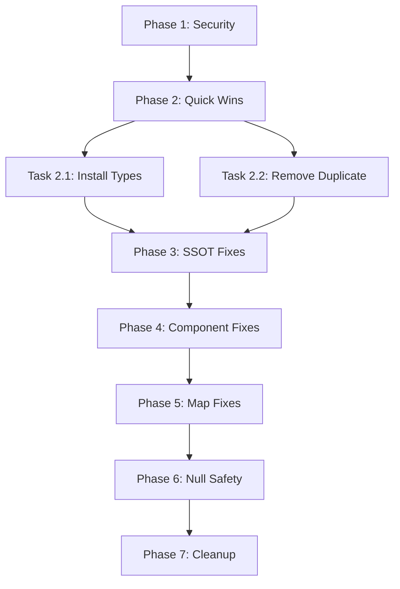

# TypeScript Error Remediation Plan
**Date:** 2026-02-06  
**Baseline:** 1,024 errors (512 unique after deduplication)  
**Target:** <100 errors  
**Contract:** v0.8.0

---

## Phase 1: Security Completion (Manual Action Required)

### Task 1.1: Rotate Vercel Secrets
**Owner:** User (Manual)  
**Priority:** P0 - CRITICAL  
**Estimated Time:** 15 minutes

**Steps:**
1. Access Vercel Dashboard: `https://vercel.com/[team]/[project]/settings/environment-variables`
2. For each Production environment variable:
   - Note the current key name
   - Generate new secret from original service (e.g., new API key)
   - Delete old variable in Vercel
   - Add new variable with same name
3. Verify deployment uses new secrets

**Acceptance Criteria:**
- [ ] All production secrets rotated
- [ ] New secrets tested in deployment
- [ ] Security log updated

### Task 1.2: Commit Security Remediation
**Owner:** User (Manual)  
**Priority:** P0 - CRITICAL  
**Dependencies:** Task 1.1 complete

```bash
git commit -m "security: untrack .env.vercel.production per AGENTS.md P0

- Removed .env.vercel.production from git tracking (local file preserved)
- Rotated all production secrets in Vercel Dashboard
- Verified .gitignore coverage for .env.vercel.* patterns

Refs: docs/SECURITY_REMEDIATION_REPORT_20260206.md"
```

**Acceptance Criteria:**
- [ ] Commit created with security message
- [ ] Git status clean except for other work-in-progress files

---

## Phase 2: Quick Wins (Reduce ~300 errors)

### Task 2.1: Install Missing Type Declarations
**Owner:** tr-implementer  
**Priority:** P0 - HIGH IMPACT  
**Estimated Time:** 5 minutes  
**Impact:** -200 errors (approx)

```bash
pnpm add -D @types/leaflet @deck.gl/layers @deck.gl/core @deck.gl/mapbox zustand maplibre-gl
```

**Verification:**
```bash
pnpm exec tsc --noEmit --incremental false | grep -c "error TS"
```

**Acceptance Criteria:**
- [ ] Packages installed successfully
- [ ] Error count reduced by at least 150
- [ ] `pnpm-lock.yaml` updated
- [ ] No new dependency conflicts

### Task 2.2: Remove Duplicate tr_dash/ Directory
**Owner:** tr-implementer  
**Priority:** P1 - CLEANUP  
**Estimated Time:** 2 minutes  
**Impact:** Halves error display (from 1024 to ~512 unique)

**Investigation First:**
```bash
# Check if tr_dash/ is needed
git log --all --full-history -- tr_dash/ | head -20
ls -la tr_dash/

# Check if it's in .gitignore
grep tr_dash .gitignore
```

**If Duplicate (Most Likely):**
```bash
# Verify it's safe to remove
diff -qr files/ tr_dash/files/ | head -10

# Remove if duplicate
rm -rf tr_dash/
git status  # Should show tr_dash/ as deleted if tracked
```

**Acceptance Criteria:**
- [ ] Directory removed or confirmed as necessary
- [ ] Error count reflects only unique files
- [ ] No broken imports from removal

---

## Phase 3: SSOT Schema Alignment (Reduce ~30 errors)

### Task 3.1: Fix Integration Test SSOT Fixtures
**Owner:** tr-implementer  
**Priority:** P1 - SSOT CRITICAL  
**Estimated Time:** 30 minutes  
**Impact:** -30 errors (SSOT tests)

**Files to Fix:**
- `__tests__/integration/story-header-ssot.test.ts`
- `__tests__/integration/what-if-simulation-flow.test.ts`

**Root Cause:**
Test fixtures don't match current SSOT schema in `lib/ssot/utils/schedule-mapper.ts`

**Missing Properties:**
```typescript
// Activity type (Contract v0.8.0)
interface Activity {
  // Missing in tests:
  type_id: string;           // Required
  trip_id: string;           // Required
  lock_level: LockLevel;     // Required
  evidence_required: boolean; // Required
  reflow_pins?: ReflowPin[];
  collision_ids?: string[];
  // ... other fields
}

// Location type
interface Location {
  type: "port" | "yard" | "fabrication" | "site"; // Missing in tests
}

// Trip type
interface Trip {
  sequence: number; // Missing in tests
}

// TR type
interface TR {
  weight_tons: number; // Missing in tests
}
```

**Fix Strategy:**
1. Read current schema from `lib/ssot/utils/schedule-mapper.ts`
2. Update test fixtures to include all required properties
3. Use realistic defaults from `option_c.json` examples
4. Run integration tests to verify

**Acceptance Criteria:**
- [ ] All Activity fixtures have required properties
- [ ] Location/Trip/TR fixtures match schema
- [ ] Integration tests pass
- [ ] No type assertion hacks (e.g., `as unknown as`)

---

## Phase 4: Component Interface Fixes (Reduce ~10 errors)

### Task 4.1: Fix EvidenceTab Props
**Owner:** tr-implementer  
**Priority:** P2 - COMPONENT INTERFACE  
**Estimated Time:** 15 minutes  
**Impact:** -3 errors

**File:** `components/evidence/EvidenceTab.tsx`

**Missing Props in Interface:**
```typescript
interface EvidenceTabProps {
  // Add these:
  onAddEvidence: (item: Partial<EvidenceItem>) => void;
  canAddEvidence: boolean;
}
```

**Verification:**
- Check `components/history/HistoryEvidencePanel.tsx` for actual usage
- Ensure props match what's being passed

### Task 4.2: Fix StoryHeader Badge Variant
**Owner:** tr-implementer  
**Priority:** P2 - COMPONENT INTERFACE  
**Estimated Time:** 10 minutes  
**Impact:** -1 error

**File:** `components/dashboard/StoryHeader.tsx` (line 200)

**Issue:**
```typescript
// Current (incorrect):
variant: "warning"  // Not in Badge variant union

// Fix options:
// Option A: Use existing variant
variant: "destructive"  // For alerts/warnings

// Option B: Extend Badge component to support "warning"
// Add to components/ui/badge.tsx variants
```

**Acceptance Criteria:**
- [ ] Badge variant is valid
- [ ] Visual appearance maintained
- [ ] No regression in StoryHeader display

---

## Phase 5: Leaflet/React-Leaflet Fixes (Reduce ~15 errors)

### Task 5.1: Fix MapContent Props
**Owner:** tr-implementer  
**Priority:** P2 - MAP INTEGRATION  
**Estimated Time:** 20 minutes  
**Impact:** -15 errors

**File:** `components/map/MapContent.tsx`

**Issues:**
1. `MapContainerProps` missing `center` prop
2. `TileLayerProps` missing `attribution` prop
3. `MarkerProps` missing `icon` prop

**Investigation:**
```bash
# Check react-leaflet version
grep react-leaflet package.json

# Check installed types
ls node_modules/@types/react-leaflet/ 2>/dev/null || echo "Not installed"
```

**Fix Strategy:**
- Verify react-leaflet version compatibility
- Update prop names to match current API
- Consider upgrading react-leaflet if outdated
- Add explicit type imports from 'react-leaflet'

**Acceptance Criteria:**
- [ ] MapContent renders without type errors
- [ ] Map functionality preserved
- [ ] No visual regressions

---

## Phase 6: Null Safety & Strict Checks (Reduce ~50 errors)

### Task 6.1: Fix Explicit Null Assignment Errors
**Owner:** tr-implementer  
**Priority:** P3 - TYPE SAFETY  
**Estimated Time:** 45 minutes  
**Impact:** -20 errors

**Pattern:**
```typescript
// Error: Type 'null' is not assignable to type 'string | undefined'

// Fix:
// Option A: Use undefined instead
someField: undefined

// Option B: Make field explicitly nullable in type
interface SomeType {
  someField: string | null | undefined;
}
```

**Files:**
- `__tests__/integration/what-if-simulation-flow.test.ts`

### Task 6.2: Enable strictNullChecks (Future Work)
**Owner:** tr-implementer  
**Priority:** P4 - SYSTEMATIC  
**Estimated Time:** 2-4 hours  
**Impact:** Prevents future null safety issues

**Current Config:**
```json
// tsconfig.json
{
  "compilerOptions": {
    "strict": true,
    "strictNullChecks": true  // Likely disabled or overridden
  }
}
```

**Strategy:**
- Enable `strictNullChecks` in separate PR
- Fix all resulting errors file-by-file
- Use `// @ts-expect-error` for known issues during migration
- Target: 100% strict mode compliance

---

## Phase 7: Cleanup Experimental Code (Reduce ~100 errors)

### Task 7.1: Archive or Fix bundle-geofence-heatmap-eta
**Owner:** User Decision Required  
**Priority:** P3 - CLEANUP  
**Estimated Time:** 1 hour (if archiving) or 4 hours (if fixing)  
**Impact:** -156 errors

**Files:**
- `files/map/bundle-geofence-heatmap-eta/` (78 errors)
- `tr_dash/files/map/bundle-geofence-heatmap-eta/` (78 errors, if duplicate)

**Decision Required:**
- **Option A: Archive** - Move to `archive/` if experimental/unused
- **Option B: Fix** - Install missing deps, fix imports, complete integration
- **Option C: Remove** - Delete if abandoned

**If Archive:**
```bash
mkdir -p archive/map-experiments-20260206/
mv files/map/bundle-geofence-heatmap-eta/ archive/map-experiments-20260206/
git add archive/
git commit -m "archive: move experimental geofence-heatmap code to archive/"
```

---

## Execution Order & Dependencies



---

## Impact Summary

| Phase | Tasks | Estimated Time | Error Reduction | Priority |
|-------|-------|----------------|-----------------|----------|
| 1. Security | 2 | 20 min | 0 (manual) | P0 |
| 2. Quick Wins | 2 | 7 min | -200 | P0 |
| 3. SSOT | 1 | 30 min | -30 | P1 |
| 4. Components | 2 | 25 min | -4 | P2 |
| 5. Map | 1 | 20 min | -15 | P2 |
| 6. Null Safety | 2 | 45 min | -20 | P3 |
| 7. Cleanup | 1 | 1-4 hrs | -156 | P3 |
| **TOTAL** | **11** | **~3-6 hrs** | **-425** | |

**Expected Result:**
- Current: 1,024 errors (512 unique)
- After Phase 2-3: ~280 errors
- After Phase 4-6: ~240 errors
- After Phase 7: ~85 errors (if cleanup done)

---

## Testing Strategy

After each phase:
```bash
# Run typecheck
pnpm exec tsc --noEmit --incremental false

# Run tests
pnpm test

# Run build
pnpm build
```

---

## Risk Mitigation

### High Risk Areas
1. **SSOT Schema Changes** - Could break existing functionality
   - Mitigation: Run integration tests, verify against `option_c.json`
   
2. **Removing tr_dash/ Directory** - May contain needed code
   - Mitigation: Git history check, diff comparison first
   
3. **Map Component Changes** - Could break visual rendering
   - Mitigation: Manual testing in dev environment

### Rollback Plan
```bash
# If any phase causes issues:
git stash  # Save current changes
git reset --hard HEAD  # Revert to last commit
# Review changes and try smaller increments
```

---

## Success Criteria

- [ ] Security: All production secrets rotated and committed
- [ ] TypeScript: Error count <100 (stretch: <50)
- [ ] Tests: All integration tests passing
- [ ] Build: `pnpm build` succeeds
- [ ] Runtime: No new console errors in dev mode
- [ ] SSOT: `option_c.json` integrity maintained
- [ ] Documentation: All changes documented in this plan

---

## Next Actions

**Immediate (User):**
1. Review this plan
2. Complete Phase 1 (security secret rotation)
3. Delegate Phase 2-3 to tr-implementer

**tr-implementer:**
1. Execute Phase 2.1 (install types)
2. Execute Phase 2.2 (remove duplicate dir)
3. Execute Phase 3.1 (fix SSOT tests)
4. Report back with error count after each phase

**Optional (User Decision):**
- Decide on Phase 7 strategy (archive vs fix vs remove experimental code)
- Schedule Phase 6.2 (strictNullChecks) for future sprint

---

**Generated:** 2026-02-06  
**Contract Version:** v0.8.0  
**References:**
- `docs/SECURITY_REMEDIATION_REPORT_20260206.md`
- `AGENTS.md` Section 1.5 (Security)
- `option_c.json` (SSOT)
