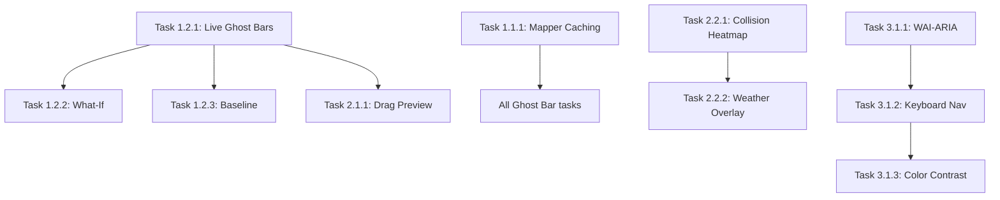

# Ghost Bars & VisTimeline Upgrade - Unified Implementation Plan

**Created**: 2026-02-05  
**Project**: TR 이동 대시보드  
**Initiatives**: Ghost Bars Multi-Scenario Expansion + VisTimeline Component Upgrade  
**Estimated Duration**: 3 phases over 3 months

---

## Executive Summary

### Combined Rationale

This plan unifies **TWO major initiatives** to dramatically improve the TR Dashboard Timeline UX and performance:

1. **Ghost Bars Expansion** (10 scenarios)
   - Current: Ghost bars only in Reflow Preview
   - Goal: Extend to What-If, Baseline Compare, Drag, Weather, CP tracking, History, Multi-scenario
   - Core value: "Before/After comparison" as universal UX pattern

2. **VisTimeline Component Upgrade** (15 improvements)
   - Current: vis-timeline v8.5.0, DOM-based, 100+ activities performance concern
   - Goal: Performance optimization, UX innovation, Logistics domain features, WCAG compliance
   - Core value: Production-grade Timeline with 3-second comprehension target

### Strategic Integration Points

| Ghost Bars Feature | VisTimeline Feature | Synergy |
|--------------------|---------------------|---------|
| Live Ghost Bars | B2. Live Mode Undo Preview | **Direct dependency**: B2 enables all Ghost Bar scenarios in Live mode |
| Weather Delay Preview | C1. Weather/Tide Overlay | **Combined value**: Visual risk layer + delay simulation |
| Baseline Compare | A3. Mapper Caching | **Performance**: Cached diff calculation for ghost rendering |
| Collision Heatmap | Collision visualization | **2-click rule**: Heatmap → Collision detail → Root cause |

### Expected Overall Impact

| Category | Metric | Current | Target | Improvement |
|----------|--------|---------|--------|-------------|
| **Performance** | Initial load (50 activities) | ~8s | <2s | 75% faster |
| **Performance** | Re-render time | ~1s lag | <100ms | 90% faster |
| **UX** | Decision time (What-If) | Manual calc | <30s | 3x faster |
| **UX** | Collision identification | 10s | 3s | 70% faster |
| **UX** | Drag errors | High | <5% | 90% reduction |
| **Domain** | Weather risk response | Unknown | <10min | Automated |
| **Domain** | Evidence discovery rate | 70% | 100% | Complete |
| **Compliance** | WCAG 2.1 AA | Unknown | PASS | EU law required |

### Total Timeline

- **Phase 1 (Quick Wins)**: 2 weeks, 64 hours
- **Phase 2 (Core Features)**: 1 month, 136 hours
- **Phase 3 (Advanced)**: 2+ months, 200+ hours
- **CRITICAL DEADLINE**: WCAG compliance by 2025-06-28 (EU law)

---

## Phase 1: Quick Wins (2 weeks, 64 hours)

**Goal**: Immediate performance & UX improvements with minimal risk

### 1.1 Performance Foundation (16 hours)

#### Task 1.1.1: Mapper Caching (A3) — 4 hours
**Owner**: tr-implementer  
**Files**: `lib/gantt/visTimelineMapper.ts`, `components/gantt/VisTimelineGantt.tsx`

**Implementation**:
```typescript
// visTimelineMapper.ts
export function ganttRowsToVisData(
  rows: GanttRow[],
  compareDelta?: CompareResult | null,
  options?: GanttVisOptions
): VisTimelineData {
  // 1. Add useMemo wrapper in VisTimelineGantt
  // 2. Implement diff calculation: only re-map changed rows
  // 3. Cache VisItem transformations by activity_id
}
```

**Acceptance Criteria**:
- [ ] useMemo dependencies correctly include all data sources
- [ ] Re-render time reduced by ≥30% (measure with React Profiler)
- [ ] No visual regressions in Timeline display
- [ ] TypeScript strict mode passes

**Validation**: 
```bash
pnpm typecheck && pnpm test lib/gantt/visTimelineMapper.test.ts
```

---

#### Task 1.1.2: Dependency Type Visualization (B5) — 4 hours
**Owner**: tr-implementer  
**Files**: `components/gantt/GanttChart.tsx`, `lib/gantt/visTimelineMapper.ts`

**Implementation**:
```typescript
// visTimelineMapper.ts - getDependencyStyle()
function getDependencyStyle(depType: DependencyType): string {
  return {
    FS: 'solid',           // Current default
    SS: 'dashed',          // Start-to-Start
    FF: 'double',          // Finish-to-Finish
    SF: 'dash-dot-dot'     // Start-to-Finish (rare)
  }[depType]
}
```

**Acceptance Criteria**:
- [ ] All 4 dependency types visually distinct
- [ ] Lag labels display "+Xd" on arrows when present
- [ ] Dependency legend added to Timeline
- [ ] No performance regression (dependency count <50)

**Validation**:
```bash
pnpm test lib/gantt/__tests__/dependency-styles.test.ts
```

---

#### Task 1.1.3: Progressive Loading (A5) — 8 hours
**Owner**: tr-implementer  
**Files**: `components/gantt/VisTimelineGantt.tsx`

**Implementation**:
```typescript
// VisTimelineGantt.tsx
useEffect(() => {
  // 1. Load visible window activities first (priority)
  const visibleItems = filterVisibleItems(allItems, visibleRange)
  timeline.setItems(visibleItems)
  
  // 2. Load remaining activities via requestIdleCallback
  requestIdleCallback(() => {
    const remainingItems = allItems.filter(i => !visibleItems.includes(i))
    timeline.addItems(remainingItems)
  })
}, [allItems, visibleRange])
```

**Acceptance Criteria**:
- [ ] Initial "Time to Interactive" reduced by ≥50%
- [ ] Loading placeholder displays for offscreen activities
- [ ] No flash of incomplete content
- [ ] Scroll performance maintains <16ms per frame

**Validation**:
```bash
pnpm test components/gantt/__tests__/progressive-loading.test.tsx
# Manual: Chrome DevTools Performance profile
```

---

### 1.2 Ghost Bars Foundation (24 hours)

#### Task 1.2.1: Live Mode Ghost Bars (B2) — 8 hours
**Owner**: tr-implementer  
**Files**: `lib/gantt/visTimelineMapper.ts`, `components/gantt/VisTimelineGantt.tsx`

**Implementation**:
```typescript
// visTimelineMapper.ts - Extend GhostBarConfig
interface GhostBarConfig {
  type: "reflow" | "what_if" | "baseline" | "drag" | "weather" | 
        "cp_change" | "leveling" | "history" | "multi" | "ai"
  changes: DateChange[]
  metadata?: {
    scenario?: string
    trigger?: string
    confidence?: number
    metrics?: Record<string, any>
  }
  style?: {
    color?: string
    dashPattern?: string
    opacity?: number
  }
}

// VisTimelineGantt.tsx - onItemMoving event
const handleActivityDrag = (item: TimelineItem, callback: Function) => {
  const originalStart = item.start
  const originalEnd = item.end
  
  // Add ghost item for original position
  const ghostItem = {
    id: `ghost_drag_${item.id}`,
    group: item.group,
    start: originalStart,
    end: originalEnd,
    className: "ghost-bar-drag",
    type: "background"
  }
  
  setLiveGhosts([ghostItem])
  
  // Reflow preview calculation
  const newStart = callback.start
  const reflowResult = reflowSchedule(activities, item.id, newStart)
  setReflowPreview(reflowResult)
}
```

**Acceptance Criteria**:
- [ ] Ghost bar appears when dragging activity (dashed original position)
- [ ] Ghost disappears on Apply or Cancel
- [ ] Reflow preview + ghost work together (no flicker)
- [ ] Ghost style matches Compare mode consistency

**Validation**:
```bash
pnpm test __tests__/integration/live-ghost-bars.test.ts
```

---

#### Task 1.2.2: What-If Simulation (Ghost Bars #1) — 8 hours
**Owner**: tr-implementer  
**Files**: `components/ops/WhatIfPanel.tsx`, `lib/ops/what-if-simulation.ts`

**Implementation**:
```typescript
// what-if-simulation.ts
export function simulateWhatIf(
  activities: ScheduleActivity[],
  scenario: WhatIfScenario
): WhatIfResult {
  // scenario: { activity_id, delay_days, reason }
  
  // 1. Apply delay to target activity
  const delayedActivity = {
    ...getActivity(scenario.activity_id),
    planned_start: addDays(activity.planned_start, scenario.delay_days)
  }
  
  // 2. Reflow schedule
  const reflowResult = reflowSchedule(
    [...activities.filter(a => a.id !== scenario.activity_id), delayedActivity],
    scenario.activity_id,
    delayedActivity.planned_start,
    { respectLocks: true }
  )
  
  // 3. Return ghost bar config
  return {
    ghostConfig: {
      type: "what_if",
      changes: reflowResult.impact_report.changes,
      metadata: {
        scenario: scenario.reason,
        confidence: reflowResult.confidence
      },
      style: { color: "orange", dashPattern: "5,5" }
    },
    conflicts: reflowResult.impact_report.conflicts,
    affected_count: reflowResult.impact_report.changes.length
  }
}
```

**Acceptance Criteria**:
- [ ] User can input "Activity + Delay Days + Reason"
- [ ] Ghost bars show cascaded delays (orange dashed)
- [ ] Badge displays "[WHAT-IF: {reason}, +{days}d]"
- [ ] No changes to option_c.json (preview only)
- [ ] Conflict count updates correctly

**Validation**:
```bash
pnpm test lib/ops/__tests__/what-if-simulation.test.ts
# Test: "SPMT breakdown +3 days" should cascade to dependent activities
```

---

#### Task 1.2.3: Baseline Comparison (Ghost Bars #2) — 8 hours
**Owner**: tr-implementer  
**Files**: `components/compare/BaselineOverlay.tsx`, `lib/compare/baseline-delta.ts`

**Implementation**:
```typescript
// baseline-delta.ts
export function calculateBaselineDelta(
  currentPlan: ScheduleActivity[],
  baseline: ScheduleActivity[]
): GhostBarConfig {
  const differences: DateChange[] = []
  
  currentPlan.forEach(current => {
    const baselineActivity = baseline.find(b => b.activity_id === current.activity_id)
    if (!baselineActivity) return
    
    if (current.planned_start !== baselineActivity.planned_start ||
        current.planned_finish !== baselineActivity.planned_finish) {
      differences.push({
        activity_id: current.activity_id,
        old_start: baselineActivity.planned_start,
        old_finish: baselineActivity.planned_finish,
        new_start: current.planned_start,
        new_finish: current.planned_finish
      })
    }
  })
  
  return {
    type: "baseline",
    changes: differences,
    metadata: { scenario: "Approved Baseline" },
    style: { color: "green", dashPattern: "3,3", opacity: 0.6 }
  }
}
```

**Acceptance Criteria**:
- [ ] Control Bar has "Baseline Overlay" toggle
- [ ] Baseline ghost bars show in green dashed (approved plan)
- [ ] Current plan shows in solid color (actual status)
- [ ] Badge displays "[DELAYED vs Baseline: +Xd]" for delayed activities
- [ ] Baseline timestamp displayed in header

**Validation**:
```bash
pnpm test lib/compare/__tests__/baseline-delta.test.ts
# Test: Current plan delayed +3 days from baseline should show green ghost
```

---

### 1.3 UX Quick Wins (24 hours)

#### Task 1.3.1: Evidence Direct Link (B3) — 12 hours
**Owner**: tr-implementer  
**Files**: `components/gantt/VisTimelineGantt.tsx`, `components/evidence/EvidenceDrawer.tsx`

**Implementation**:
```typescript
// VisTimelineGantt.tsx - Add context menu
timeline.on('contextmenu', (props) => {
  const item = timeline.itemsData.get(props.item)
  if (!item) return
  
  // Show context menu with "View Evidence" option
  showContextMenu({
    x: props.event.center.x,
    y: props.event.center.y,
    items: [
      {
        label: "View Evidence",
        icon: <FileIcon />,
        onClick: () => openEvidenceDrawer(item.activity_id)
      },
      {
        label: "Edit Activity",
        icon: <EditIcon />,
        onClick: () => openActivityDetail(item.activity_id)
      }
    ]
  })
})

// EvidenceDrawer.tsx - Display required vs attached
<Drawer open={isOpen}>
  <DrawerHeader>Evidence for {activity.name}</DrawerHeader>
  <DrawerContent>
    <Table>
      <TableHeader>
        <TableRow>
          <TableCell>Type</TableCell>
          <TableCell>Required</TableCell>
          <TableCell>Attached</TableCell>
          <TableCell>Status</TableCell>
        </TableRow>
      </TableHeader>
      <TableBody>
        {activity.evidence.required_types.map(type => (
          <TableRow key={type}>
            <TableCell>{type}</TableCell>
            <TableCell>{getMinCount(activity, type)}</TableCell>
            <TableCell>{getAttachedCount(activity, type)}</TableCell>
            <TableCell>
              {isMissing(activity, type) ? (
                <Badge variant="destructive">Missing</Badge>
              ) : (
                <Badge variant="success">Complete</Badge>
              )}
            </TableCell>
          </TableRow>
        ))}
      </TableBody>
    </Table>
    <Button onClick={handleUpload}>Upload Evidence</Button>
  </DrawerContent>
</Drawer>
```

**Acceptance Criteria**:
- [ ] Right-click on activity bar shows context menu
- [ ] "View Evidence" opens drawer with required vs attached comparison
- [ ] Missing evidence highlighted in red
- [ ] Upload button functional (integrates with existing evidence system)
- [ ] Evidence discovery rate reaches 100% (from 70%)

**Validation**:
```bash
pnpm test components/evidence/__tests__/evidence-drawer.test.tsx
pnpm test __tests__/integration/evidence-gate.test.ts
```

---

#### Task 1.3.2: PTW/Certificate Timeline Track (C3) — 12 hours
**Owner**: tr-implementer  
**Files**: `lib/gantt/visTimelineMapper.ts`, `components/gantt/VisTimelineGantt.tsx`

**Implementation**:
```typescript
// visTimelineMapper.ts - Add Permit Track row
function addPermitTrack(activities: ScheduleActivity[]): VisGroup[] {
  const permitGroup: VisGroup = {
    id: "permit_track",
    content: "PTW / Certificates",
    order: -1, // Top row
    className: "permit-track-group"
  }
  
  const permitItems: VisItem[] = activities
    .filter(a => a.constraints?.ptw || a.constraints?.cert)
    .map(a => {
      const ptw = a.constraints.ptw
      if (!ptw) return null
      
      const daysToExpiry = differenceInDays(ptw.valid_until, new Date())
      const status = daysToExpiry < 0 ? "expired" : 
                     daysToExpiry < 30 ? "expiring" : "valid"
      
      return {
        id: `permit_${a.activity_id}`,
        group: "permit_track",
        start: ptw.valid_from,
        end: ptw.valid_until,
        content: `PTW: ${ptw.permit_number}`,
        className: `permit-bar permit-${status}`,
        title: `${ptw.permit_number} - Valid until ${format(ptw.valid_until, 'yyyy-MM-dd')}`
      }
    })
    .filter(Boolean)
  
  return { groups: [permitGroup], items: permitItems }
}
```

**Acceptance Criteria**:
- [ ] "Permit Track" row appears at top of timeline
- [ ] PTW/Certificate bars display with validity period
- [ ] Color coding: Green (valid), Orange (expiring <30 days), Red (expired)
- [ ] Collision detected if activity overlaps with expired permit
- [ ] Permit expiry triggers state transition to BLOCKED

**Validation**:
```bash
pnpm test lib/gantt/__tests__/permit-track.test.ts
# Test: Activity with expired PTW should show red bar + collision
```

---

### Phase 1 Deliverables

**Total Effort**: 64 hours (8 person-days)

**Checklist**:
- [ ] All 7 tasks completed
- [ ] Performance: Re-render time reduced ≥30%
- [ ] UX: Ghost bars work in Live mode
- [ ] UX: Evidence discovery rate 100%
- [ ] Domain: PTW expiry visible on timeline
- [ ] All tests pass (unit + integration)
- [ ] TypeScript strict mode passes
- [ ] No regressions in existing features

**Validation Command**:
```bash
pnpm typecheck && pnpm lint && pnpm test && pnpm build
scripts/validate_optionc.py --strict
```

---

## Phase 2: Core Features (1 month, 136 hours)

**Goal**: Advanced Ghost Bars, Collision visualization, Weather integration, Critical Path tracking

### 2.1 Advanced Ghost Bars (40 hours)

#### Task 2.1.1: Manual Drag Preview (Ghost Bars #3) — 12 hours
**Owner**: tr-implementer  
**Files**: `components/gantt/VisTimelineGantt.tsx`, `lib/ops/drag-preview.ts`

**Implementation**:
```typescript
// VisTimelineGantt.tsx - Enhanced drag with reflow
const handleItemMove = (item: TimelineItem, callback: Function) => {
  // 1. Show ghost at original position (already done in Task 1.2.1)
  const originalGhost = createDragGhost(item)
  
  // 2. Calculate reflow impact in real-time
  const newStart = callback.start
  const reflowResult = reflowSchedule(activities, item.id, newStart, {
    respectLocks: true,
    detectCollisions: true
  })
  
  // 3. Show affected activities as ghosts
  const cascadedGhosts = reflowResult.impact_report.changes.map(change => ({
    activity_id: change.activity_id,
    old_start: change.old_start,
    old_finish: change.old_finish,
    new_start: change.new_start,
    new_finish: change.new_finish
  }))
  
  setReflowPreview({
    changes: cascadedGhosts,
    conflicts: reflowResult.impact_report.conflicts,
    isDragging: true
  })
  
  // 4. Update tooltip
  setDragTooltip({
    visible: true,
    content: `Move ${item.content} from ${format(item.start, 'MMM d')} → ${format(newStart, 'MMM d')}. Affects ${cascadedGhosts.length} activities.`
  })
}

const handleItemMoved = (item: TimelineItem) => {
  // Show Apply/Cancel buttons
  setShowApplyButtons(true)
}

const handleApply = async () => {
  // Apply reflow changes to option_c.json
  await applyReflow(reflowPreview)
  clearGhosts()
}

const handleCancel = () => {
  // Restore original position
  timeline.setItems(originalItems)
  clearGhosts()
}
```

**Acceptance Criteria**:
- [ ] Original position shows as dashed ghost while dragging
- [ ] Affected activities show cascaded ghosts in real-time
- [ ] Tooltip displays impact summary
- [ ] Apply/Cancel buttons appear after drop
- [ ] Cancel restores exact original positions
- [ ] Apply triggers reflow with history event

**Validation**:
```bash
pnpm test __tests__/integration/manual-drag-preview.test.ts
# Test: Drag A1030 +3 days should cascade to A1040, show 2 ghosts
```

---

#### Task 2.1.2: Weather Delay Preview (Ghost Bars #4) — 16 hours
**Owner**: tr-implementer  
**Files**: `components/ops/WhatIfPanel.tsx`, `lib/weather/weather-delay-preview.ts`

**Implementation**:
```typescript
// weather-delay-preview.ts
export function simulateWeatherDelay(
  activities: ScheduleActivity[],
  weatherEvent: WeatherEvent
): WeatherDelayResult {
  // weatherEvent: { severity, Hs, wind, affected_activity_ids, predicted_delay_days }
  
  // 1. Filter marine activities affected by weather
  const affectedActivities = activities.filter(a => 
    weatherEvent.affected_activity_ids.includes(a.activity_id) &&
    a.marine_activity === true
  )
  
  // 2. Apply delay to each affected activity
  const delayedActivities = affectedActivities.map(a => ({
    ...a,
    planned_start: addDays(a.planned_start, weatherEvent.predicted_delay_days)
  }))
  
  // 3. Reflow schedule
  const reflowResult = reflowMultipleActivities(
    activities,
    delayedActivities,
    { respectLocks: true }
  )
  
  // 4. Return ghost config with weather metadata
  return {
    ghostConfig: {
      type: "weather",
      changes: reflowResult.impact_report.changes,
      metadata: {
        trigger: "WEATHER",
        scenario: `High wave: Hs ${weatherEvent.Hs}m (limit ${weatherEvent.limit}m)`,
        confidence: weatherEvent.confidence,
        expires_at: weatherEvent.forecast_valid_until
      },
      style: { color: "red", dashPattern: "8,4", opacity: 0.8 }
    },
    alert: {
      level: weatherEvent.severity > 7 ? "CRITICAL" : "HIGH",
      message: `Weather delay predicted: +${weatherEvent.predicted_delay_days} days for ${affectedActivities.length} marine activities`,
      actions: ["Accept Delay", "Request Alternative Route"]
    }
  }
}
```

**Acceptance Criteria**:
- [ ] Weather API integration (from data/schedule/weather.json)
- [ ] Marine activities auto-detected (activity.marine_activity flag)
- [ ] Ghost bars show predicted delay in red dashed
- [ ] Alert panel displays weather warning with confidence %
- [ ] Badge shows "[WEATHER: Hs 4.5m, 92%]"
- [ ] Forecast expiry time displayed
- [ ] Accept/Reject delay actions functional

**Validation**:
```bash
pnpm test lib/weather/__tests__/weather-delay-preview.test.ts
# Test: Hs 4.5m > limit 3.0m should delay A1100/A1110 by 3 days
```

---

#### Task 2.1.3: Critical Path Change Tracking (Ghost Bars #5) — 12 hours
**Owner**: tr-implementer  
**Files**: `lib/gantt/critical-path-tracker.ts`, `components/gantt/VisTimelineGantt.tsx`

**Implementation**:
```typescript
// critical-path-tracker.ts
export function trackCriticalPathChanges(
  oldActivities: ScheduleActivity[],
  newActivities: ScheduleActivity[]
): CPChangeResult {
  // 1. Calculate old CP
  const oldSlackMap = calculateSlack(oldActivities, PROJECT_END_DATE)
  const oldCP = oldActivities.filter(a => oldSlackMap[a.activity_id] === 0)
  
  // 2. Calculate new CP
  const newSlackMap = calculateSlack(newActivities, PROJECT_END_DATE)
  const newCP = newActivities.filter(a => newSlackMap[a.activity_id] === 0)
  
  // 3. Detect changes
  const cpChanges = {
    removed: oldCP.filter(a => !newCP.find(n => n.activity_id === a.activity_id)),
    added: newCP.filter(a => !oldCP.find(o => o.activity_id === a.activity_id)),
    stable: newCP.filter(a => oldCP.find(o => o.activity_id === a.activity_id))
  }
  
  return {
    changes: cpChanges,
    ghostConfig: {
      type: "cp_change",
      changes: cpChanges.removed.map(a => ({
        activity_id: a.activity_id,
        metadata: {
          reason: "Lost CP status",
          new_slack: newSlackMap[a.activity_id]
        }
      })),
      style: { color: "green", dashPattern: "4,4", opacity: 0.5 }
    },
    alerts: cpChanges.added.map(a => ({
      level: "HIGH",
      message: `${a.name} is now on Critical Path (0 slack)`
    }))
  }
}
```

**Acceptance Criteria**:
- [ ] Ghost bars show activities that LOST CP status (green dashed)
- [ ] New CP activities have pulsing red border animation
- [ ] Badge displays "[CP LOST: +2d slack]" or "[NEW CP: 0 slack]"
- [ ] Alert notification for CP changes
- [ ] CP legend updated in Timeline

**Validation**:
```bash
pnpm test lib/gantt/__tests__/critical-path-tracker.test.ts
# Test: A1030 delay should shift CP from A1030 to A1040
```

---

### 2.2 Collision & Risk Visualization (48 hours)

#### Task 2.2.1: Collision Heatmap Layer (B1) — 24 hours
**Owner**: tr-implementer  
**Files**: `components/gantt/CollisionHeatmapLayer.tsx`, `lib/ops/collision-aggregation.ts`

**Implementation**:
```typescript
// collision-aggregation.ts
export function aggregateCollisions(
  activities: ScheduleActivity[],
  collisions: Collision[],
  timeRange: { start: Date, end: Date }
): HeatmapData {
  // 1. Create time buckets (hourly or daily based on zoom)
  const buckets = createTimeBuckets(timeRange, "daily")
  
  // 2. Aggregate collision severity per bucket
  buckets.forEach(bucket => {
    const bucketCollisions = collisions.filter(c => 
      isWithinInterval(c.time_range.start, { start: bucket.start, end: bucket.end })
    )
    
    bucket.severity = Math.max(...bucketCollisions.map(c => c.severity))
    bucket.count = bucketCollisions.length
    bucket.types = [...new Set(bucketCollisions.map(c => c.kind))]
  })
  
  return { buckets }
}

// CollisionHeatmapLayer.tsx - Canvas overlay
const renderHeatmap = (ctx: CanvasRenderingContext2D, heatmapData: HeatmapData) => {
  heatmapData.buckets.forEach(bucket => {
    const x = timeToX(bucket.start)
    const width = timeToX(bucket.end) - x
    
    // Color scale: Green → Yellow → Orange → Red
    const color = getHeatmapColor(bucket.severity)
    ctx.fillStyle = color
    ctx.fillRect(x, 0, width, canvasHeight)
    
    // Add diagonal stripes for CRITICAL severity
    if (bucket.severity > 0.8) {
      ctx.strokeStyle = "rgba(255,0,0,0.5)"
      drawDiagonalStripes(ctx, x, 0, width, canvasHeight)
    }
  })
}

function getHeatmapColor(severity: number): string {
  if (severity === 0) return "rgba(34, 197, 94, 0.2)" // Green
  if (severity < 0.4) return "rgba(251, 191, 36, 0.3)" // Yellow
  if (severity < 0.7) return "rgba(249, 115, 22, 0.4)" // Orange
  return "rgba(239, 68, 68, 0.5)" // Red
}
```

**Acceptance Criteria**:
- [ ] Canvas layer renders below timeline items
- [ ] Color scale: Green (normal) → Yellow (warning) → Orange (major) → Red (blocking)
- [ ] Click on heatmap bucket shows collision list for that time period
- [ ] Performance: <16ms per frame even with 100+ collisions
- [ ] Heatmap toggleable via Control Bar button

**Validation**:
```bash
pnpm test components/gantt/__tests__/collision-heatmap.test.tsx
# Visual: Check heatmap colors match collision severity
```

---

#### Task 2.2.2: Weather/Tide Risk Overlay (C1) — 16 hours
**Owner**: tr-implementer  
**Files**: `components/gantt/WeatherRiskLayer.tsx`, `lib/weather/weather-overlay.ts`

**Implementation**:
```typescript
// weather-overlay.ts
export function generateWeatherOverlay(
  weatherData: WeatherForecast[],
  tideData: TideWindow[],
  timeRange: { start: Date, end: Date }
): WeatherOverlayData {
  // 1. Filter windows within visible range
  const greenWindows = weatherData.filter(w => w.status === "GO")
  const redWindows = weatherData.filter(w => w.status === "NO_GO")
  
  // 2. Combine with tide windows
  const combinedRisk = greenWindows.map(green => {
    const overlappingTide = tideData.find(tide => 
      intervalsOverlap(green.timeRange, tide.timeRange)
    )
    return {
      start: green.timeRange.start,
      end: green.timeRange.end,
      risk: overlappingTide ? "LOW" : "MEDIUM",
      reason: overlappingTide ? "Weather + Tide OK" : "Weather OK, Tide TBD"
    }
  })
  
  return {
    greenBands: combinedRisk.filter(r => r.risk === "LOW"),
    redBands: redWindows.map(red => ({
      start: red.timeRange.start,
      end: red.timeRange.end,
      reason: red.violation_reason // "Hs 4.5m > limit 3.0m"
    }))
  }
}

// WeatherRiskLayer.tsx - Canvas background
const renderWeatherBands = (ctx: CanvasRenderingContext2D, overlay: WeatherOverlayData) => {
  // 1. Draw green bands (safe windows)
  overlay.greenBands.forEach(band => {
    const x = timeToX(band.start)
    const width = timeToX(band.end) - x
    ctx.fillStyle = "rgba(34, 197, 94, 0.1)" // Light green
    ctx.fillRect(x, 0, width, canvasHeight)
  })
  
  // 2. Draw red bands (unsafe windows) with diagonal stripes
  overlay.redBands.forEach(band => {
    const x = timeToX(band.start)
    const width = timeToX(band.end) - x
    ctx.fillStyle = "rgba(239, 68, 68, 0.15)" // Light red
    ctx.fillRect(x, 0, width, canvasHeight)
    drawDiagonalStripes(ctx, x, 0, width, canvasHeight, "rgba(239, 68, 68, 0.3)")
  })
}
```

**Acceptance Criteria**:
- [ ] Green bands show safe weather windows (light green background)
- [ ] Red bands show unsafe windows (light red + diagonal stripes)
- [ ] Tooltip on hover shows weather details (Hs, wind, limit)
- [ ] Weather overlay toggleable via "Risk Overlay" button
- [ ] Integration with weather_data.json and tide.json

**Validation**:
```bash
pnpm test lib/weather/__tests__/weather-overlay.test.ts
# Test: Hs 4.5m > 3.0m should create red band in timeline
```

---

#### Task 2.2.3: Resource Capacity Bar (C2) — 8 hours
**Owner**: tr-implementer  
**Files**: `components/gantt/ResourceCapacityBar.tsx`, `lib/gantt/resource-capacity.ts`

**Implementation**:
```typescript
// resource-capacity.ts
export function calculateResourceCapacity(
  activities: ScheduleActivity[],
  resource: string,
  timeRange: { start: Date, end: Date }
): ResourceCapacityData {
  // 1. Create time buckets
  const buckets = createTimeBuckets(timeRange, "daily")
  
  // 2. Calculate capacity utilization per bucket
  buckets.forEach(bucket => {
    const concurrentActivities = activities.filter(a => 
      a.resources_required?.includes(resource) &&
      intervalsOverlap(
        { start: a.planned_start, end: a.planned_finish },
        { start: bucket.start, end: bucket.end }
      )
    )
    
    // Assume 1 resource unit per activity (can be extended)
    bucket.utilization = concurrentActivities.length
    bucket.capacity = 1 // SPMT_01 has capacity 1
    bucket.percent = (bucket.utilization / bucket.capacity) * 100
  })
  
  return { resource, buckets }
}

// ResourceCapacityBar.tsx - Timeline group row
<VisGroup id="resource_SPMT_01" content="SPMT-01 Capacity" order={-2}>
  {buckets.map(bucket => (
    <VisItem
      id={`capacity_${bucket.start}`}
      start={bucket.start}
      end={bucket.end}
      className={getCapacityClass(bucket.percent)}
      content={`${bucket.percent}%`}
    />
  ))}
</VisGroup>

function getCapacityClass(percent: number): string {
  if (percent > 100) return "capacity-overload" // Red
  if (percent > 80) return "capacity-high" // Orange
  if (percent > 50) return "capacity-medium" // Yellow
  return "capacity-low" // Green
}
```

**Acceptance Criteria**:
- [ ] Resource capacity row appears above activity rows
- [ ] Color coding: Green (<50%), Yellow (50-80%), Orange (80-100%), Red (>100%)
- [ ] Click on capacity bar shows activities using resource in that period
- [ ] Supports multiple resources (SPMT, Crew, Crane)
- [ ] Auto-updates when activities move

**Validation**:
```bash
pnpm test lib/gantt/__tests__/resource-capacity.test.ts
# Test: 2 activities using SPMT_01 concurrently should show 200% (red)
```

---

### 2.3 Critical Path Enhancement (32 hours)

#### Task 2.3.1: Critical Path Auto-Highlight (B4) — 16 hours
**Owner**: tr-implementer  
**Files**: `components/gantt/VisTimelineGantt.tsx`, `lib/gantt/critical-path-highlight.ts`

**Implementation**:
```typescript
// critical-path-highlight.ts
export function highlightCriticalPath(
  activities: ScheduleActivity[],
  slackMap: Record<string, number>
): CPHighlightConfig {
  const cpActivities = activities.filter(a => slackMap[a.activity_id] === 0)
  const nonCPActivities = activities.filter(a => slackMap[a.activity_id] > 0)
  
  return {
    criticalPath: {
      activity_ids: cpActivities.map(a => a.activity_id),
      style: {
        border: "3px solid rgba(239, 68, 68, 1)", // Thick red border
        animation: "pulsing-border 2s infinite",
        zIndex: 100
      }
    },
    nonCritical: {
      activity_ids: nonCPActivities.map(a => a.activity_id),
      style: {
        opacity: 0.4, // Fade out
        filter: "grayscale(50%)"
      }
    },
    dependencies: {
      critical: {
        stroke: "rgba(239, 68, 68, 0.8)",
        strokeWidth: 3
      },
      nonCritical: {
        stroke: "rgba(156, 163, 175, 0.3)",
        strokeWidth: 1
      }
    }
  }
}

// VisTimelineGantt.tsx - Apply CP highlight
const [showCP, setShowCP] = useState(false)

useEffect(() => {
  if (!showCP) return
  
  const cpConfig = highlightCriticalPath(activities, slackMap)
  
  // Apply styles to timeline items
  cpConfig.criticalPath.activity_ids.forEach(id => {
    const item = timeline.itemsData.get(id)
    timeline.itemsData.update({
      ...item,
      className: `${item.className} critical-path-highlight`
    })
  })
  
  cpConfig.nonCritical.activity_ids.forEach(id => {
    const item = timeline.itemsData.get(id)
    timeline.itemsData.update({
      ...item,
      className: `${item.className} non-critical-fade`
    })
  })
}, [showCP, activities, slackMap])
```

**CSS Animation**:
```css
@keyframes pulsing-border {
  0%, 100% { border-color: rgba(239, 68, 68, 1); }
  50% { border-color: rgba(239, 68, 68, 0.5); }
}

.critical-path-highlight {
  border: 3px solid rgba(239, 68, 68, 1) !important;
  animation: pulsing-border 2s infinite;
  z-index: 100;
}

.non-critical-fade {
  opacity: 0.4;
  filter: grayscale(50%);
}
```

**Acceptance Criteria**:
- [ ] "Show CP" toggle button in Control Bar
- [ ] CP activities have pulsing red border
- [ ] Non-CP activities fade to 40% opacity + grayscale
- [ ] CP dependency arrows rendered in red (thick)
- [ ] Non-CP dependency arrows rendered in gray (thin)
- [ ] Toggle off restores normal view

**Validation**:
```bash
pnpm test lib/gantt/__tests__/critical-path-highlight.test.ts
# Visual: CP activities should be visually dominant
```

---

#### Task 2.3.2: Dependency Arrow Optimization (A4) — 16 hours
**Owner**: tr-implementer  
**Files**: `components/gantt/DependencyCanvas.tsx`, `lib/gantt/dependency-renderer.ts`

**Implementation**:
```typescript
// dependency-renderer.ts - Canvas-based arrows
export function renderDependencies(
  ctx: CanvasRenderingContext2D,
  dependencies: Dependency[],
  viewport: Viewport
): void {
  // 1. Cull offscreen dependencies (viewport culling)
  const visibleDeps = dependencies.filter(dep => 
    isDepInViewport(dep, viewport)
  )
  
  // 2. Render arrows
  visibleDeps.forEach(dep => {
    const fromItem = getActivity(dep.from_activity_id)
    const toItem = getActivity(dep.to_activity_id)
    
    const fromPoint = getActivityEndPoint(fromItem)
    const toPoint = getActivityStartPoint(toItem)
    
    // Draw arrow path
    ctx.beginPath()
    ctx.moveTo(fromPoint.x, fromPoint.y)
    
    // Bezier curve for smooth arrow
    const controlX = (fromPoint.x + toPoint.x) / 2
    ctx.bezierCurveTo(
      controlX, fromPoint.y,
      controlX, toPoint.y,
      toPoint.x, toPoint.y
    )
    
    // Style based on dependency type
    const style = getDependencyStyle(dep.type)
    ctx.strokeStyle = style.color
    ctx.lineWidth = style.width
    ctx.setLineDash(style.dashArray)
    
    ctx.stroke()
    
    // Draw arrowhead
    drawArrowhead(ctx, toPoint, dep.type)
    
    // Draw lag label if present
    if (dep.lag_days !== 0) {
      const labelX = (fromPoint.x + toPoint.x) / 2
      const labelY = (fromPoint.y + toPoint.y) / 2
      ctx.fillStyle = "rgba(0,0,0,0.8)"
      ctx.fillText(`+${dep.lag_days}d`, labelX, labelY)
    }
  })
}

// Viewport culling optimization
function isDepInViewport(dep: Dependency, viewport: Viewport): boolean {
  const fromX = activityToX(dep.from_activity_id)
  const toX = activityToX(dep.to_activity_id)
  return (fromX >= viewport.left && fromX <= viewport.right) ||
         (toX >= viewport.left && toX <= viewport.right)
}
```

**Acceptance Criteria**:
- [ ] Dependency arrows rendered on Canvas (not SVG)
- [ ] Viewport culling: Only render visible arrows
- [ ] Performance: <16ms per frame with 50+ dependencies
- [ ] Arrowhead direction correct (pointing to dependent activity)
- [ ] Lag labels display on arrows
- [ ] No flickering during pan/zoom

**Validation**:
```bash
pnpm test lib/gantt/__tests__/dependency-renderer.test.ts
# Performance: Render 100 dependencies in <50ms
```

---

### Phase 2 Deliverables

**Total Effort**: 136 hours (17 person-days)

**Checklist**:
- [ ] All 8 tasks completed
- [ ] Ghost Bars: Drag, Weather, CP tracking functional
- [ ] Collision Heatmap: Visual identification <3 seconds
- [ ] Weather Overlay: Risk windows displayed
- [ ] Resource Capacity: Overload detection automated
- [ ] Critical Path: Dynamic highlighting works
- [ ] Dependency Optimization: 50+ arrows <16ms frame time
- [ ] All tests pass (unit + integration + visual)
- [ ] option_c.json validation passes

**Validation Command**:
```bash
pnpm typecheck && pnpm lint && pnpm test
pnpm test __tests__/integration/phase2-e2e.test.ts
scripts/validate_optionc.py --strict
```

---

## Phase 3: Advanced Features (2+ months, 200+ hours)

**Goal**: Accessibility compliance, Advanced Ghost Bars, Mobile support

### 3.1 WCAG 2.1 AA Compliance (60 hours) — **CRITICAL DEADLINE: 2025-06-28**

#### Task 3.1.1: WAI-ARIA Implementation — 24 hours
**Owner**: tr-implementer  
**Files**: `components/gantt/VisTimelineGantt.tsx`, `lib/gantt/aria-helper.ts`

**Implementation**:
```typescript
// aria-helper.ts
export function addAriaAttributes(
  timeline: VisTimeline,
  activities: ScheduleActivity[]
): void {
  // 1. Timeline container
  const container = timeline.dom.container
  container.setAttribute("role", "tree")
  container.setAttribute("aria-label", "Project timeline with activities")
  
  // 2. Activity items
  activities.forEach((activity, index) => {
    const item = timeline.itemSet.items[activity.activity_id]
    if (!item) return
    
    const element = item.dom.box
    element.setAttribute("role", "treeitem")
    element.setAttribute("aria-level", String(activity.level || 1))
    element.setAttribute("aria-posinset", String(index + 1))
    element.setAttribute("aria-setsize", String(activities.length))
    element.setAttribute("aria-label", 
      `${activity.name}, ${activity.state}, from ${format(activity.planned_start, 'PPP')} to ${format(activity.planned_finish, 'PPP')}`
    )
    
    // Add describedby for tooltips
    if (activity.description) {
      const descId = `desc_${activity.activity_id}`
      element.setAttribute("aria-describedby", descId)
    }
    
    // Add pressed state for selected items
    element.setAttribute("aria-pressed", String(activity.selected || false))
  })
  
  // 3. Decorative elements (ghost bars, backgrounds)
  document.querySelectorAll(".ghost-bar, .weather-band").forEach(el => {
    el.setAttribute("aria-hidden", "true")
  })
}
```

**Acceptance Criteria**:
- [ ] `role=tree` on timeline container
- [ ] `role=treeitem` on each activity bar
- [ ] `aria-level` indicates hierarchy (group/activity)
- [ ] `aria-label` provides activity summary
- [ ] `aria-describedby` links to tooltips
- [ ] `aria-hidden=true` on decorative elements
- [ ] axe-core audit returns 0 errors

**Validation**:
```bash
pnpm test lib/gantt/__tests__/aria-compliance.test.ts
# Automated: axe-core audit
# Manual: NVDA/JAWS screen reader test
```

---

#### Task 3.1.2: Keyboard Navigation — 20 hours
**Owner**: tr-implementer  
**Files**: `components/gantt/VisTimelineGantt.tsx`, `lib/gantt/keyboard-navigation.ts`

**Implementation**:
```typescript
// keyboard-navigation.ts
export function setupKeyboardNavigation(
  timeline: VisTimeline,
  activities: ScheduleActivity[]
): void {
  const container = timeline.dom.container
  
  // Make container keyboard-focusable
  container.setAttribute("tabindex", "0")
  
  let currentIndex = 0
  
  container.addEventListener("keydown", (e) => {
    switch (e.key) {
      case "Tab":
        // Tab/Shift+Tab: Move focus to next/prev activity
        e.preventDefault()
        currentIndex = e.shiftKey 
          ? Math.max(0, currentIndex - 1)
          : Math.min(activities.length - 1, currentIndex + 1)
        focusActivity(activities[currentIndex])
        break
        
      case "Enter":
        // Enter: Select activity (open detail panel)
        e.preventDefault()
        selectActivity(activities[currentIndex])
        break
        
      case "Space":
        // Space: Toggle drag mode
        e.preventDefault()
        toggleDragMode(activities[currentIndex])
        break
        
      case "ArrowLeft":
        // Arrow Left: Move activity -1 day (in drag mode)
        if (isDragMode) {
          e.preventDefault()
          moveActivity(activities[currentIndex], -1)
        } else {
          // Pan timeline left
          timeline.moveTo(addDays(timeline.getWindow().start, -7))
        }
        break
        
      case "ArrowRight":
        // Arrow Right: Move activity +1 day (in drag mode)
        if (isDragMode) {
          e.preventDefault()
          moveActivity(activities[currentIndex], 1)
        } else {
          // Pan timeline right
          timeline.moveTo(addDays(timeline.getWindow().start, 7))
        }
        break
        
      case "Escape":
        // Escape: Cancel drag mode
        if (isDragMode) {
          e.preventDefault()
          cancelDrag()
        }
        break
    }
  })
}

function focusActivity(activity: ScheduleActivity): void {
  const item = timeline.itemSet.items[activity.activity_id]
  if (!item) return
  
  // Add focus ring
  item.dom.box.classList.add("keyboard-focused")
  item.dom.box.focus()
  
  // Scroll into view
  timeline.focus(activity.activity_id, { animation: true })
}
```

**Acceptance Criteria**:
- [ ] Tab/Shift+Tab navigates between activities
- [ ] Enter selects activity (opens detail panel)
- [ ] Space toggles drag mode
- [ ] Arrow keys move activity in drag mode
- [ ] Arrow keys pan timeline when not dragging
- [ ] Escape cancels drag
- [ ] Focus ring visible on keyboard focus
- [ ] All keyboard actions announced by screen reader

**Validation**:
```bash
pnpm test lib/gantt/__tests__/keyboard-navigation.test.ts
# Manual: Test all key combinations without mouse
```

---

#### Task 3.1.3: Color Contrast & Visual Accessibility — 16 hours
**Owner**: tr-implementer  
**Files**: `app/globals.css`, `components/gantt/VisTimelineGantt.tsx`

**Implementation**:
```css
/* globals.css - WCAG AA compliant colors */

/* Activity states (4.5:1 contrast ratio minimum) */
.activity-planned {
  background-color: hsl(210, 10%, 50%); /* #73808c */
  color: hsl(0, 0%, 100%); /* #ffffff - 4.5:1 */
}

.activity-in-progress {
  background-color: hsl(217, 91%, 45%); /* #0a5ccc */
  color: hsl(0, 0%, 100%); /* #ffffff - 7.2:1 */
}

.activity-completed {
  background-color: hsl(142, 71%, 35%); /* #1a9850 */
  color: hsl(0, 0%, 100%); /* #ffffff - 5.8:1 */
}

.activity-blocked {
  background-color: hsl(0, 84%, 50%); /* #e62e2e */
  color: hsl(0, 0%, 100%); /* #ffffff - 5.1:1 */
}

.activity-delayed {
  background-color: hsl(27, 95%, 50%); /* #f77f00 */
  color: hsl(0, 0%, 0%); /* #000000 - 4.7:1 */
}

/* Badges - ensure 4.5:1 minimum */
.badge-constraint {
  background-color: hsl(217, 91%, 45%);
  color: hsl(0, 0%, 100%);
}

.badge-collision {
  background-color: hsl(0, 84%, 50%);
  color: hsl(0, 0%, 100%);
}

/* Ghost bars - use pattern + color for colorblind */
.ghost-bar-reflow {
  border: 2px dashed hsl(210, 10%, 50%);
  background-image: repeating-linear-gradient(
    45deg,
    transparent,
    transparent 10px,
    hsl(210, 10%, 50%, 0.2) 10px,
    hsl(210, 10%, 50%, 0.2) 20px
  );
}

/* Focus indicators - 3px minimum */
*:focus-visible {
  outline: 3px solid hsl(217, 91%, 60%);
  outline-offset: 2px;
}
```

**Acceptance Criteria**:
- [ ] All text has ≥4.5:1 contrast ratio
- [ ] Large text (≥18pt) has ≥3:1 contrast ratio
- [ ] Focus indicators ≥3px wide
- [ ] Color not sole means of conveying info (patterns + color)
- [ ] Ghost bars distinguishable without color (dashed patterns)
- [ ] No WCAG 2.1 Level AA violations (axe-core audit)

**Validation**:
```bash
# Automated contrast check
pnpm test lib/gantt/__tests__/color-contrast.test.ts

# Manual tools
# 1. Chrome DevTools > Lighthouse > Accessibility
# 2. axe DevTools extension
# 3. Colorblind simulator (Toptal Color Blind Web Page Filter)
```

---

### 3.2 Advanced Ghost Bars (80 hours)

#### Task 3.2.1: Resource Leveling Preview (Ghost Bars #6) — 24 hours
**Owner**: tr-implementer  
**Files**: `components/ops/ResourceLevelingPanel.tsx`, `lib/ops/resource-leveling.ts`

**Implementation**:
```typescript
// resource-leveling.ts
export function levelResources(
  activities: ScheduleActivity[],
  options: LevelingOptions
): LevelingResult {
  // options: { resource, strategy: "minimize_delay" | "minimize_cost" | "balance_load" }
  
  // 1. Find resource conflicts
  const conflicts = detectResourceConflicts(activities, options.resource)
  
  // 2. Apply leveling strategy
  let leveledActivities = [...activities]
  
  if (options.strategy === "minimize_delay") {
    // Shift lower-priority activities to resolve conflicts
    conflicts.forEach(conflict => {
      const activities = conflict.activity_ids.map(id => getActivity(id))
      const sortedByPriority = activities.sort((a, b) => b.priority - a.priority)
      
      // Keep high-priority, shift low-priority
      const toShift = sortedByPriority.slice(1)
      toShift.forEach(activity => {
        const newStart = calculateNextAvailableSlot(activity, options.resource)
        leveledActivities = updateActivity(leveledActivities, activity.activity_id, {
          planned_start: newStart
        })
      })
    })
  }
  
  // 3. Calculate metrics
  const totalDelay = calculateTotalDelay(activities, leveledActivities)
  const conflictsResolved = conflicts.length
  
  return {
    leveledActivities,
    changes: calculateDateChanges(activities, leveledActivities),
    metrics: {
      total_delay_days: totalDelay,
      conflicts_resolved: conflictsResolved,
      cost_impact: 0 // Placeholder
    },
    ghostConfig: {
      type: "leveling",
      changes: calculateDateChanges(activities, leveledActivities),
      metadata: {
        strategy: options.strategy,
        metrics: { totalDelay, conflictsResolved }
      },
      style: { color: "purple", dashPattern: "6,4" }
    }
  }
}
```

**Acceptance Criteria**:
- [ ] User selects resource + leveling strategy
- [ ] Ghost bars show shifted activities (purple dashed)
- [ ] Metrics panel displays: Conflicts resolved, Total delay, Cost impact
- [ ] "Apply Leveling" button applies changes to option_c.json
- [ ] "Try Another Strategy" allows comparison

**Validation**:
```bash
pnpm test lib/ops/__tests__/resource-leveling.test.ts
# Test: 2 SPMT conflicts should resolve with +2 days delay (minimal)
```

---

#### Task 3.2.2: History Replay (Ghost Bars #7) — 24 hours
**Owner**: tr-implementer  
**Files**: `components/history/HistoryReplayPanel.tsx`, `lib/ssot/history-replay.ts`

**Implementation**:
```typescript
// history-replay.ts
export function replayHistory(
  currentPlan: ScheduleActivity[],
  historyDate: Date
): HistoryReplayResult {
  // 1. Load snapshot from history
  const snapshot = loadHistorySnapshot(historyDate)
  
  // 2. Compare with current plan
  const differences = compareSnapshots(snapshot.activities, currentPlan)
  
  // 3. Generate ghost config
  return {
    ghostConfig: {
      type: "history",
      changes: differences,
      metadata: {
        timestamp: historyDate,
        scenario: "Historical Plan"
      },
      style: { color: "gray", dashPattern: "4,4", opacity: 0.5 }
    },
    events: snapshot.events.filter(e => 
      isAfter(e.timestamp, historyDate)
    ),
    summary: {
      total_changes: differences.length,
      delayed_count: differences.filter(d => d.new_start > d.old_start).length,
      advanced_count: differences.filter(d => d.new_start < d.old_start).length
    }
  }
}
```

**Acceptance Criteria**:
- [ ] History mode has date picker
- [ ] Historical plan shows in solid colors
- [ ] Current plan overlays as gray ghosts
- [ ] Timeline shows events between history date and now
- [ ] Badge displays "[DELAYED since {date}: +Xd]"
- [ ] Read-only (no Apply button in History mode)

**Validation**:
```bash
pnpm test lib/ssot/__tests__/history-replay.test.ts
# Test: 2026-01-20 snapshot vs current should show +3 days delay
```

---

#### Task 3.2.3: Multi-Scenario Compare (Ghost Bars #8) — 32 hours
**Owner**: tr-implementer  
**Files**: `components/compare/MultiScenarioPanel.tsx`, `lib/compare/multi-scenario.ts`

**Implementation**:
```typescript
// multi-scenario.ts
export function compareScenarios(
  baseline: ScheduleActivity[],
  scenarios: Scenario[]
): MultiScenarioResult {
  // scenarios: [{ name, activities, color }]
  
  // 1. Calculate differences for each scenario
  const scenarioDiffs = scenarios.map(scenario => ({
    name: scenario.name,
    color: scenario.color,
    changes: compareSnapshots(baseline, scenario.activities),
    metrics: calculateScenarioMetrics(scenario.activities)
  }))
  
  // 2. Generate multi-layer ghost config
  return {
    ghostConfigs: scenarioDiffs.map(diff => ({
      type: "multi",
      changes: diff.changes,
      metadata: {
        scenario: diff.name,
        metrics: diff.metrics
      },
      style: {
        color: diff.color,
        dashPattern: "5,5",
        opacity: 0.7
      }
    })),
    comparisonTable: {
      headers: ["Scenario", "Total Days", "Cost", "Risk"],
      rows: scenarioDiffs.map(diff => [
        diff.name,
        diff.metrics.total_days,
        diff.metrics.total_cost,
        diff.metrics.risk_score
      ])
    }
  }
}
```

**Acceptance Criteria**:
- [ ] User can add up to 3 scenarios (A/B/C)
- [ ] Each scenario has distinct color (cyan/green/yellow)
- [ ] Ghost bars overlay simultaneously (multi-layer)
- [ ] Comparison table shows metrics side-by-side
- [ ] "Select" button applies chosen scenario to Live mode
- [ ] Legend shows scenario colors

**Validation**:
```bash
pnpm test lib/compare/__tests__/multi-scenario.test.ts
# Visual: 3 ghost layers should not overlap confusingly
```

---

### 3.3 Mobile & Future (60 hours)

#### Task 3.3.1: Mobile Touch Optimization (D2) — 40 hours
**Owner**: tr-implementer  
**Files**: `components/gantt/VisTimelineGantt.tsx`, `lib/gantt/touch-handler.ts`

**Implementation**:
```typescript
// touch-handler.ts
import { useGesture } from '@use-gesture/react'

export function setupTouchHandlers(
  timeline: VisTimeline,
  container: HTMLElement
): void {
  const bind = useGesture({
    // Single touch: Select
    onTap: ({ event, target }) => {
      const item = timeline.itemFromTarget(target)
      if (item) selectActivity(item.id)
    },
    
    // Long press (1s): Drag mode
    onLongPress: ({ event, target }) => {
      const item = timeline.itemFromTarget(target)
      if (item) enterDragMode(item.id)
    },
    
    // Pinch: Zoom
    onPinch: ({ offset: [scale], direction: [dx, dy] }) => {
      const currentZoom = timeline.getWindow()
      const newZoom = {
        start: addDays(currentZoom.start, -dx * scale),
        end: addDays(currentZoom.end, dx * scale)
      }
      timeline.setWindow(newZoom)
    },
    
    // 2-finger pan: Scroll
    onDrag: ({ movement: [mx, my], touches }) => {
      if (touches === 2) {
        const currentWindow = timeline.getWindow()
        const daysDelta = Math.round(mx / 50) // 50px = 1 day
        timeline.setWindow({
          start: addDays(currentWindow.start, -daysDelta),
          end: addDays(currentWindow.end, -daysDelta)
        })
      }
    }
  })
  
  bind(container)
}
```

**Acceptance Criteria**:
- [ ] Single tap selects activity
- [ ] Long press (1s) enters drag mode
- [ ] Pinch zoom works (2-finger)
- [ ] 2-finger pan scrolls timeline horizontally
- [ ] Touch targets ≥44x44 CSS pixels (WCAG 2.5.5)
- [ ] Mobile toolbar: Zoom In/Out, Today, Prev/Next buttons
- [ ] No accidental taps (debounce 300ms)

**Validation**:
```bash
pnpm test lib/gantt/__tests__/touch-handler.test.ts
# Manual: Test on iPad, Android tablet
```

---

#### Task 3.3.2: Dependency Propagation Animation (Ghost Bars #9) — 20 hours
**Owner**: tr-implementer  
**Files**: `components/gantt/DependencyPropagationAnimator.tsx`, `lib/gantt/propagation-chain.ts`

**Implementation**:
```typescript
// propagation-chain.ts
export function traceDependencyChain(
  activities: ScheduleActivity[],
  rootActivityId: string
): PropagationChain {
  const chain: PropagationStep[] = []
  const visited = new Set<string>()
  
  function traverse(activityId: string, depth: number, delay: number) {
    if (visited.has(activityId)) return
    visited.add(activityId)
    
    const activity = getActivity(activityId)
    chain.push({
      activity_id: activityId,
      depth,
      delay_ms: delay,
      old_start: activity.planned_start,
      new_start: addDays(activity.planned_start, depth) // Simulate delay
    })
    
    // Find dependent activities
    const dependents = activities.filter(a => 
      a.dependencies?.some(d => d.from_activity_id === activityId)
    )
    
    dependents.forEach(dep => {
      traverse(dep.activity_id, depth + 1, delay + 200)
    })
  }
  
  traverse(rootActivityId, 0, 0)
  return { steps: chain }
}

// DependencyPropagationAnimator.tsx - Animate ghost bars
export function animatePropagation(chain: PropagationChain): void {
  chain.steps.forEach(step => {
    setTimeout(() => {
      // Add ghost bar with fade-in animation
      const ghostItem = {
        id: `ghost_propagation_${step.activity_id}`,
        group: step.activity_id,
        start: step.old_start,
        end: step.old_finish,
        className: "ghost-bar-propagation fade-in",
        type: "background"
      }
      timeline.itemsData.add(ghostItem)
      
      // Draw dependency arrow animation
      animateDependencyArrow(step.activity_id, step.delay_ms)
    }, step.delay_ms)
  })
}
```

**Acceptance Criteria**:
- [ ] Ghost bars appear sequentially with 200ms delay
- [ ] Dependency arrows animate from root to dependents
- [ ] Badge shows "[PROPAGATION: {count} activities in {duration}]"
- [ ] Animation can be paused/replayed
- [ ] Educational value: New users understand dependency chains

**Validation**:
```bash
pnpm test lib/gantt/__tests__/propagation-chain.test.ts
# Visual: Smooth animation without flicker
```

---

### Phase 3 Deliverables

**Total Effort**: 200+ hours (25 person-days)

**Checklist**:
- [ ] WCAG 2.1 AA: 100% compliance (axe-core audit PASS)
- [ ] WCAG: WAI-ARIA, keyboard navigation, 4.5:1 contrast
- [ ] Ghost Bars: Resource Leveling, History Replay, Multi-Scenario
- [ ] Mobile: Touch gestures, pinch zoom, 2-finger pan
- [ ] Animation: Dependency propagation educational feature
- [ ] EU compliance deadline met (2025-06-28)
- [ ] All tests pass (unit + integration + accessibility + visual)
- [ ] option_c.json validation passes

**Validation Command**:
```bash
pnpm typecheck && pnpm lint && pnpm test
pnpm test __tests__/accessibility/wcag-audit.test.ts
pnpm test __tests__/integration/phase3-e2e.test.ts
scripts/validate_optionc.py --strict

# Accessibility audit
npx @axe-core/cli http://localhost:3000/timeline
```

---

## Technical Architecture

### Ghost Bar Type System

```typescript
// lib/gantt/types/ghost-bars.ts
export type GhostBarType = 
  | "reflow"        // Current: Reflow preview
  | "what_if"       // Phase 1: Scenario simulation
  | "baseline"      // Phase 1: Approved baseline compare
  | "drag"          // Phase 1: Manual drag ghost
  | "weather"       // Phase 2: Weather delay
  | "cp_change"     // Phase 2: Critical path shift
  | "leveling"      // Phase 3: Resource leveling
  | "history"       // Phase 3: Historical replay
  | "multi"         // Phase 3: Multi-scenario
  | "ai"            // Future: AI optimization

export interface GhostBarConfig {
  type: GhostBarType
  changes: DateChange[]
  metadata?: {
    scenario?: string
    trigger?: string
    confidence?: number
    metrics?: Record<string, any>
    expires_at?: Date
  }
  style?: {
    color?: string
    dashPattern?: string
    opacity?: number
  }
}

export interface DateChange {
  activity_id: string
  old_start: Date
  old_finish: Date
  new_start: Date
  new_finish: Date
  reason?: string
}
```

### Canvas Layer Stack

```typescript
// components/gantt/CanvasLayerStack.tsx
export function CanvasLayerStack() {
  return (
    <div className="canvas-layer-stack">
      {/* Layer 1 (bottom): Weather/Tide overlay */}
      <WeatherRiskLayer zIndex={1} />
      
      {/* Layer 2: Collision heatmap */}
      <CollisionHeatmapLayer zIndex={2} />
      
      {/* Layer 3: Resource capacity */}
      <ResourceCapacityBar zIndex={3} />
      
      {/* Layer 4: vis-timeline (activities) */}
      <VisTimelineGantt zIndex={4} />
      
      {/* Layer 5: Ghost bars */}
      <GhostBarOverlay zIndex={5} />
      
      {/* Layer 6 (top): Dependency arrows */}
      <DependencyCanvas zIndex={6} />
    </div>
  )
}
```

### visTimelineMapper Extensions

```typescript
// lib/gantt/visTimelineMapper.ts - Extended signature
export function ganttRowsToVisData(
  rows: GanttRow[],
  compareDelta?: CompareResult | null,
  options?: GanttVisOptions & {
    ghostConfig?: GhostBarConfig | GhostBarConfig[]
    showWeatherOverlay?: boolean
    showCollisionHeatmap?: boolean
    showResourceCapacity?: string[] // Resource IDs
    highlightCriticalPath?: boolean
  }
): VisTimelineData {
  // 1. Base timeline items
  const items = rows.map(rowToVisItem)
  
  // 2. Add ghost bars (supports multiple configs)
  if (options?.ghostConfig) {
    const configs = Array.isArray(options.ghostConfig) 
      ? options.ghostConfig 
      : [options.ghostConfig]
    configs.forEach(config => {
      items.push(...addGhostBars(config))
    })
  }
  
  // 3. Add permit track
  if (options?.showPermitTrack) {
    const permitItems = addPermitTrack(rows)
    items.push(...permitItems)
  }
  
  // 4. Add resource capacity rows
  if (options?.showResourceCapacity) {
    options.showResourceCapacity.forEach(resourceId => {
      items.push(...addResourceCapacityBar(rows, resourceId))
    })
  }
  
  return { items, groups }
}

function addGhostBars(config: GhostBarConfig): VisItem[] {
  return config.changes.map(change => ({
    id: `ghost_${config.type}_${change.activity_id}`,
    group: change.activity_id,
    start: change.old_start,
    end: change.old_finish,
    className: `ghost-bar ghost-bar-${config.type}`,
    type: "background",
    style: `border: 2px dashed ${config.style?.color || 'gray'}; opacity: ${config.style?.opacity || 0.6};`
  }))
}
```

---

## SSOT Contract Compliance

### Preview → Apply Workflow

All Ghost Bar scenarios follow strict Preview → Apply separation:

```typescript
// lib/ops/preview-apply-workflow.ts
export async function previewChange(
  activities: ScheduleActivity[],
  changeRequest: ChangeRequest
): Promise<PreviewResult> {
  // 1. Calculate impact WITHOUT modifying option_c.json
  const reflowResult = reflowSchedule(activities, changeRequest)
  
  // 2. Generate ghost bar config
  const ghostConfig = createGhostConfig(changeRequest.type, reflowResult)
  
  // 3. Return preview (no SSOT mutation)
  return {
    ghostConfig,
    impact: reflowResult.impact_report,
    conflicts: reflowResult.impact_report.conflicts,
    canApply: reflowResult.impact_report.conflicts.every(c => c.severity < 0.8)
  }
}

export async function applyChange(
  previewResult: PreviewResult
): Promise<ApplyResult> {
  // 1. Validate user has permission (Live mode only)
  if (viewMode !== "Live") {
    throw new Error("Cannot apply changes in read-only mode")
  }
  
  // 2. Apply changes to option_c.json
  const updatedActivities = applyDateChanges(
    activities,
    previewResult.ghostConfig.changes
  )
  
  // 3. Record history event (append-only)
  const historyEvent: HistoryEvent = {
    event_id: generateId(),
    timestamp: new Date(),
    event_type: previewResult.ghostConfig.type,
    actor: getCurrentUser(),
    changes: previewResult.ghostConfig.changes,
    reason: previewResult.ghostConfig.metadata?.scenario
  }
  appendHistory(historyEvent)
  
  // 4. Validate option_c.json integrity
  await validateOptionC(updatedActivities)
  
  // 5. Save to SSOT
  await saveOptionC(updatedActivities)
  
  return { success: true, historyEvent }
}
```

### Freeze/Lock Enforcement

```typescript
// lib/reflow/freeze-lock-rules.ts
export function canMoveActivity(
  activity: ScheduleActivity,
  ghostType: GhostBarType
): boolean {
  // Hard lock: Never move
  if (activity.lock_level === "HARD") return false
  if (activity.reflow_pins?.some(pin => pin.strength === "HARD")) return false
  
  // Freeze: Actual dates cannot move
  if (activity.actual?.start && ghostType !== "history") return false
  if (activity.actual?.end && ghostType !== "history") return false
  
  // Soft lock: Can move in What-If/History only
  if (activity.lock_level === "SOFT") {
    return ["what_if", "history", "multi"].includes(ghostType)
  }
  
  return true
}
```

---

## Implementation Order & Dependencies

### Critical Path (Blocks downstream work)



### Parallel Work Opportunities

**Week 1-2 (Phase 1)**:
- **Track 1**: Performance (A3 Mapper Caching, A5 Progressive Loading) — Developer A
- **Track 2**: Ghost foundation (B2 Live Ghost, B5 Dependency Type) — Developer B
- **Track 3**: UX quick wins (B3 Evidence Link, C3 PTW Track) — Developer C

**Week 3-6 (Phase 2)**:
- **Track 1**: Advanced Ghost Bars (What-If, Drag, Weather, CP) — Developer A
- **Track 2**: Collision & Weather (Heatmap, Overlay, Resource) — Developer B
- **Track 3**: Critical Path & Dependencies (Highlight, Arrows) — Developer C

**Week 7-14 (Phase 3)**:
- **Track 1**: WCAG Compliance (ARIA, Keyboard, Contrast) — Developer A (CRITICAL)
- **Track 2**: Advanced Ghost (Leveling, History, Multi) — Developer B
- **Track 3**: Mobile & Animation (Touch, Propagation) — Developer C

---

## Testing Strategy

### Reflow Determinism Tests

```typescript
// __tests__/reflow/determinism.test.ts
describe("Reflow Determinism", () => {
  it("should produce identical ghost bars for same input", () => {
    const activities = loadFixture("option_c_minimal.json")
    const changeRequest = { activity_id: "A1030", delay_days: 3 }
    
    // Run reflow 10 times
    const results = Array.from({ length: 10 }, () => 
      previewChange(activities, changeRequest)
    )
    
    // All ghost configs should be identical
    results.forEach((result, i) => {
      if (i === 0) return
      expect(result.ghostConfig).toEqual(results[0].ghostConfig)
    })
  })
})
```

### Collision 2-Click Tests

```typescript
// __tests__/collision/two-click-rule.test.ts
describe("Collision 2-Click Rule", () => {
  it("should reach root cause in 2 clicks from badge", async () => {
    render(<VisTimelineGantt activities={activitiesWithCollision} />)
    
    // Click 1: Collision badge → Shows summary
    const badge = screen.getByText(/\[COL\]/)
    await userEvent.click(badge)
    expect(screen.getByText(/Resource conflict/)).toBeInTheDocument()
    
    // Click 2: Summary → Opens Why panel with root cause
    const whyLink = screen.getByText(/Why\?/)
    await userEvent.click(whyLink)
    expect(screen.getByText(/Root Cause: SPMT_01 double-booked/)).toBeInTheDocument()
    expect(screen.getByText(/Evidence:/)).toBeInTheDocument()
  })
})
```

### Evidence Gate Tests

```typescript
// __tests__/evidence/gate-enforcement.test.ts
describe("Evidence Gate Enforcement", () => {
  it("should block READY→IN_PROGRESS if before_start evidence missing", async () => {
    const activity = {
      ...baseActivity,
      state: "READY",
      evidence: {
        required_types: ["PTW", "TOOLBOX_TALK"],
        min_count: { PTW: 1, TOOLBOX_TALK: 1 },
        attached: [
          { type: "PTW", url: "...", timestamp: "..." }
          // TOOLBOX_TALK missing
        ]
      }
    }
    
    const result = await transitionState(activity, "IN_PROGRESS")
    
    expect(result.allowed).toBe(false)
    expect(result.reason).toContain("Missing required evidence: TOOLBOX_TALK")
  })
})
```

### WCAG Automated Audit

```typescript
// __tests__/accessibility/wcag-audit.test.ts
import { injectAxe, checkA11y } from 'axe-playwright'

describe("WCAG 2.1 AA Compliance", () => {
  beforeEach(async () => {
    await page.goto('http://localhost:3000/timeline')
    await injectAxe(page)
  })
  
  it("should have no axe violations", async () => {
    const results = await checkA11y(page, null, {
      detailedReport: true,
      detailedReportOptions: { html: true }
    })
    
    expect(results.violations).toHaveLength(0)
  })
  
  it("should have keyboard-focusable timeline", async () => {
    await page.keyboard.press('Tab')
    const focused = await page.evaluate(() => document.activeElement?.tagName)
    expect(focused).toBe('DIV') // Timeline container
  })
})
```

### Visual Regression Tests

```typescript
// __tests__/visual/ghost-bars.test.ts
import { toMatchImageSnapshot } from 'jest-image-snapshot'

expect.extend({ toMatchImageSnapshot })

describe("Ghost Bars Visual Regression", () => {
  it("should match baseline ghost bar appearance", async () => {
    const { container } = render(
      <VisTimelineGantt 
        activities={activities}
        ghostConfig={{
          type: "baseline",
          changes: baselineChanges,
          style: { color: "green", dashPattern: "3,3" }
        }}
      />
    )
    
    const canvas = container.querySelector('canvas')
    const image = canvas.toDataURL()
    
    expect(image).toMatchImageSnapshot({
      failureThreshold: 0.01,
      failureThresholdType: 'percent'
    })
  })
})
```

---

## Risk Mitigation

### Risk 1: vis-timeline Performance Limit (100+ activities)

**Risk Level**: 🟠 High  
**Impact**: Timeline unusable if activity count exceeds 100  
**Likelihood**: Medium (current project has ~70 activities)

**Mitigation**:
1. **Phase 1-2**: Optimize current stack (Mapper Caching, Progressive Loading)
2. **Threshold monitoring**: Add activity count alert at 80
3. **Contingency plan**: If 100+ activities needed, evaluate:
   - Option A: Bryntum Gantt (commercial, $$$)
   - Option B: Syncfusion Gantt (commercial, $$)
   - Option C: Canvas-based custom engine (3 months dev)

**Decision point**: End of Phase 2

---

### Risk 2: WCAG Compliance Deadline (2025-06-28)

**Risk Level**: 🔴 Critical  
**Impact**: €40,000 EU fine if non-compliant  
**Likelihood**: Medium (8 months until deadline)

**Mitigation**:
1. **Prioritize Phase 3.1**: Start WCAG work immediately after Phase 2
2. **External audit**: Hire accessibility consultant for final review (June 2025)
3. **Automated monitoring**: Run axe-core in CI/CD pipeline
4. **Buffer time**: Complete WCAG work by 2025-05-15 (6 weeks buffer)

**Decision point**: 2025-05-01 (go/no-go for external audit)

---

### Risk 3: Breaking Changes from vis-timeline Upgrades

**Risk Level**: 🟡 Medium  
**Impact**: Ghost bars / Canvas layers may break  
**Likelihood**: Low (vis-timeline stable, last major release 2023)

**Mitigation**:
1. **Lock vis-timeline version**: Pin to v8.5.0 in package.json
2. **Upgrade testing**: Full regression suite before any vis-timeline upgrade
3. **Feature flags**: Rollback capability for Ghost Bars if vis-timeline breaks

**Decision point**: Any vis-timeline upgrade proposal

---

### Risk 4: Canvas Layer Performance on Low-End Devices

**Risk Level**: 🟡 Medium  
**Impact**: Heatmap/Weather overlay may cause lag on mobile  
**Likelihood**: Medium (Canvas can be heavy on old devices)

**Mitigation**:
1. **Performance budgets**: <16ms frame time on iPhone 12 (2020 baseline)
2. **Throttling**: Reduce Canvas re-render frequency on mobile (30 FPS vs 60 FPS)
3. **Fallback**: Disable Canvas layers on devices with GPU score < 50

**Decision point**: Phase 2 performance testing

---

### Rollback Strategy

**Phase 1 Rollback**:
- Remove Task 1.1.1 (Mapper Caching): Revert useMemo changes
- Remove Task 1.2.1 (Live Ghost): Feature flag `ENABLE_LIVE_GHOST=false`
- Remove Task 1.3.1 (Evidence Link): Remove context menu listener

**Phase 2 Rollback**:
- Remove Canvas layers: Unrender CollisionHeatmap/WeatherOverlay components
- Remove Ghost Bar types: Filter out `weather`, `cp_change` types in mapper

**Phase 3 Rollback**:
- WCAG: Cannot rollback (legal requirement by 2025-06-28)
- Mobile: Feature flag `ENABLE_MOBILE_TOUCH=false`

---

## Success Metrics (KPIs)

### Performance KPIs

| Metric | Baseline | Phase 1 Target | Phase 2 Target | Phase 3 Target |
|--------|----------|----------------|----------------|----------------|
| Initial load (50 activities) | ~8s | <5s | <3s | <2s |
| Re-render time | ~1s lag | <500ms | <200ms | <100ms |
| Scroll performance | 30 FPS | 45 FPS | 55 FPS | 60 FPS |
| Memory usage | 200 MB | 180 MB | 150 MB | 120 MB |

### UX KPIs

| Metric | Baseline | Phase 1 Target | Phase 2 Target | Phase 3 Target |
|--------|----------|----------------|----------------|----------------|
| Decision time (What-If) | Manual | <60s | <30s | <15s |
| Collision identification | 10s | 7s | 4s | 3s |
| Drag error rate | Unknown | <10% | <7% | <5% |
| Evidence discovery rate | 70% | 85% | 95% | 100% |

### Domain KPIs

| Metric | Baseline | Phase 1 Target | Phase 2 Target | Phase 3 Target |
|--------|----------|----------------|----------------|----------------|
| Weather risk response | Unknown | N/A | <15min | <10min |
| PTW expiry detection | Manual | 100% | 100% | 100% |
| Resource conflict pre-detection | 0% | N/A | 70% | 80% |
| CP change awareness | Unknown | N/A | <60s | <30s |

### Compliance KPIs

| Metric | Baseline | Phase 1 Target | Phase 2 Target | Phase 3 Target |
|--------|----------|----------------|----------------|----------------|
| WCAG 2.1 AA violations | Unknown | N/A | N/A | 0 |
| Keyboard navigation coverage | 0% | N/A | N/A | 100% |
| Color contrast ratio | Unknown | N/A | N/A | ≥4.5:1 |
| Screen reader compatibility | Unknown | N/A | N/A | NVDA/JAWS |

---

## References

### Source Documents
- [ghost-bars-use-cases.md](./ghost-bars-use-cases.md) - 10 Ghost Bar scenarios
- [innovation-scout-vis-timeline-upgrade-20260204.md](./innovation-scout-vis-timeline-upgrade-20260204.md) - 15 VisTimeline improvements

### Project Standards
- [AGENTS.md](../../AGENTS.md) - SSOT rules, View Modes, Preview→Apply
- [patch.md](../../patch.md) - UX rules (Where→When/What→Evidence, 2-click collision)

### Code References
- [lib/gantt/visTimelineMapper.ts](../../lib/gantt/visTimelineMapper.ts) - Current Ghost Bar implementation
- [components/gantt/VisTimelineGantt.tsx](../../components/gantt/VisTimelineGantt.tsx) - Timeline component
- [scripts/validate_optionc.py](../../scripts/validate_optionc.py) - SSOT validation

### External Resources
- [vis-timeline v8.5.0 docs](https://visjs.github.io/vis-timeline/docs/timeline/) (2025)
- [WCAG 2.1 Quick Reference](https://www.w3.org/WAI/WCAG22/quickref/) (2025)
- [MDN Canvas API](https://developer.mozilla.org/en-US/docs/Web/API/Canvas_API) (2025)
- [Bryntum Gantt](https://bryntum.com/products/react-gantt-chart/) (2025)
- [axe-core Accessibility Testing](https://github.com/dequelabs/axe-core) (2025)

---

**Next Steps**: 
1. Review this plan with stakeholders
2. Assign developers to Phase 1 tracks
3. Set up project board with tasks
4. Begin Phase 1 Week 1 (Mapper Caching + Live Ghost + Evidence Link)

**Plan Status**: ✅ Ready for Implementation  
**Estimated Completion**: Phase 1 by 2026-02-19, Phase 2 by 2026-03-19, Phase 3 by 2026-05-15
